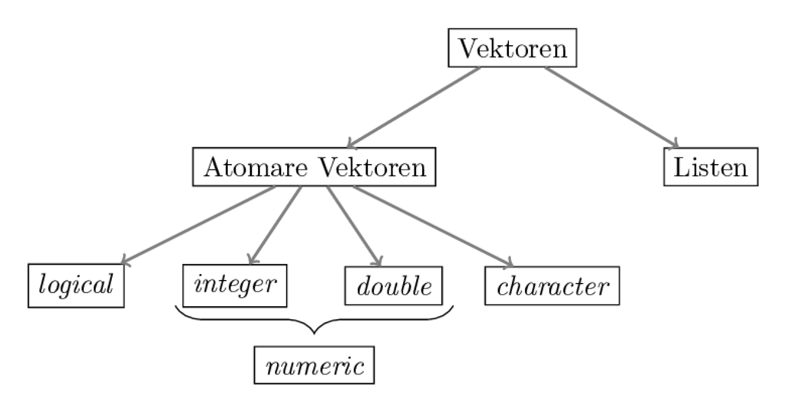

# Erste Schritte in R {#basics}

```{r include=FALSE}
knitr::opts_chunk$set(comment = "#>")
```

```{r, echo=FALSE, message=FALSE, warning=FALSE}
library(tufte)
```

Nach den (wichtigen) Vorbereitungsschritten im vorangehenden Kapitel 
wollen wir an dieser Stelle mit dem eigentlichen Programmieren anfangen.
Zu diesem Zweck müssen wir uns mit der Syntax von R vertraut machen,
also mit den Regeln, denen wir folgen müssen, wenn wir Code schreiben, damit der 
Computer versteht, was wir ihm eigentlich in R sagen wollen.

Das Kapitel ist dabei folgendermaßen aufgebaut:
zunächst lernen wir in Abschnitt \@ref(es:befehle) wie wir mit Hilfe von R und 
R-Studio mit unserem Computer 'kommunizieren' können. 
Danach lernen wir in Abschnitt \@ref(es:objekte) nicht nur die zentralen Elemente 
der Programmiersprache R kennen, nämlich Objekte und Funktionen, sondern
lernen auch wie wir solche Objekte erstellen und ihnen Namen zuweisen können.
Ein großer Teil des Kapitels (Abschnitt \@ref(es:objektarten)) ist dann den 
unterschiedlichen Arten von Objekten in R gewidmet. Wir lernen zum Beispiel
wie sich Vektoren von Listen unterscheiden, und welche Pendants in R es zu
'Zahlen' und 'Wörtern' in unserer Alltagssprache gibt.
Abgeschlossen wir das Kapitel mit einer kurzen Einführung von 'Paketen' in
Abschnitt \@ref(es:pakete).
Pakete sind ein wichtiger Bestandteil der Open-Source Sprache R:
hier handelt es sich um Code, den andere Menschen geschrieben und der 
Allgemeinheit frei zugänglich gemacht haben. 
Dadurch ist sichergestellt, dass R immer auf dem neuesten Stand der 
Forschung und Praxis ist.

## Befehle in R an den Computer übermitteln {#es:befehle}

Grundsätzlich können wir über R Studio auf zwei Arten mit dem Computer
"kommunizieren": über die Konsole direkt, oder indem wir im Skriptbereich ein
Skript schreiben und dies dann ausführen.

Als Beispiel für die erste Möglichkeit wollen wir mit Hilfe von R die Zahlen 
`2` und `5` miteinander addieren. 
Zu diesem Zweck können wir einfach `2 + 5` in die Konsole eingeben, und den
Befehl mit 'Enter' an den Computer senden. 
Da es sich beim Ausdruck `2 + 5` um korrekten R Code handelt, 'versteht' der
Computer was wir von ihm wollen und gibt uns das entsprechende Ergebnis aus:

```{r}
2 + 5
```

Die Zeichenkombination `#>` am Beginn der Zeile zeigt an, dass es sich bei 
dieser Zeile um den Output eines R-Befehlt handelt. Das kann bei Ihrem
Computer durchaus anders aussehen. 
Das Ergebnis von `2+5` ist eine Zahl (genauer: ein 'Skalar'). 
In R werden Skalare immer als Vektor der Länge 1 dargestellt.
Die `[1]` gibt also an, dass hier ein Vektor der Länge 1 angezeigt wird.
Wäre das Ergebnis unserer Berechnung ein Vektor der Länge 2 würde die 
Outputzeile dementsprechend mit `#> [2]` eingeleitet werden.

Auf diese Art und Weise können wir R als einfachen Taschenrechner verwenden,
denn für alle einfachen mathematischen Operationen können wir bestimmte Symbole
als Operatoren verwenden.
An dieser Stelle sei noch darauf hingewiesen, dass das Symbol `#` in R einen
Kommentar einleitet, das heißt alles was in einer Zeile nach `#` steht wird
vom Computer ignoriert und man kann sich an dieser Stelle Notizen im Code machen.

```{r}
2 + 5 # Addition
```

```{r}
2/2 # Division
```

```{r}
4*2 # Multiplikation
```

```{r}
3**2 # Potenzierung
```

Alternativ können wir die Befehle in einem Skript aufschreiben, und dieses Skript
dann ausführen. Während die Interaktion über die Konsole sinnvoll ist um die 
Effekte bestimmter Befehle auszuprobieren, bietet sich die Verwendung von 
Skripten an, wenn wir mit den Befehlen später weiter arbeiten wollen, oder sie
anderen Menschen zugänglich zu machen. Denn das Skript können wir als Datei auf 
unserem Computer speichern, vorzugsweise im Unterordner `R` unseres R-Projekts
(siehe Abschnitt [Relevante Unterordner erstellen](#unterordner)), und dann 
später weiterverwenden. 

Die Berechnungen, die wir bislang durchgeführt haben sind zugegebenermaßen nicht 
sonderlich spannend.
Um fortgeschrittene Operationen in R durchführen und verstehen zu können müssen
wir uns zunächst mit den Konzepten von **Objekten**, **Funktionen** und
**Zuweisungen** beschäftigen.

## Objekte, Funktionen und Zuweisungen {#es:objekte}

> To understand computations in R, two slogans are helpful:
>   Everything that exists is an object.
>   Everything that happens is a function call.
> `r tufte::quote_footer('--- John Chambers')`

Mit der Aussage 'Alles in R ist ein Objekt' ist gemeint, dass jede Zahl, jede
Funktion, oder jeder Buchstabe in R ein Objekt ist, das irgendwo auf dem 
Speicher Ihres Rechners abgespeichert ist. 

In der Berechnung `2 + 3` ist die Zahl `2` genauso ein Objekt wie die Zahl `3`
und die Additionsfunktion, die durch den Operator `+` aufgerufen wird.

Mit der Aussage 'Alles was in R passiert ist ein Funktionsaufruf' ist gemeint,
dass wir R eine Berechnung durchführen lassen indem wir eine Funktion aufrufen.

**Funktionen** sind Algorithmen, die bestimmte Routinen auf einen *Input* 
anwenden und dabei einen *Output* produzieren. 
Die Additionsfunktion, die wir in der Berechnung `2 + 3` aufgerufen haben hat 
als Input die beiden Zahlen `2` und `3` aufgenommen, hat auf sie die Routine 
der Addition angewandt und als Output die Zahl `5` ausgegeben.
Der Output `5` ist dabei in R genauso ein Objekt wie die Inputs `2` und `3`, 
sowie die Funktion `+`.

Ein 'Problem' ist, dass R im vorliegenden Fall den Output der Berechnung 
zwar ausgibt, wir danach aber keinen Zugriff darauf mehr haben:

```{r}
2 + 3
```

Falls wir den Output weiterverwenden wollen, macht es Sinn, dem Output Objekt
einen Namen zu geben, damit wir später wieder darauf zugreifen können.
Der Prozess einem Objekt einen Namen zu geben wird **Zuweisung** oder 
**Assignment** genannt und durch die Funktion `assign` vorgenommen:

```{r}
assign("zwischenergebnis", 2 + 3)
```

Wir können nun das Ergebnis der Berechnung `2 + 3` aufrufen, indem wir in R
den Namen des Output Objekts eingeben:

```{r}
zwischenergebnis
```

Da Zuweisungen so eine große Rolle spielen und sehr häufig vorkommen gibt es 
auch für die Funktion `assign` eine Kurzschreibweise, nämlich `<-`. 
Entsprechend sind die folgenden beiden Befehle äquivalent:

```{r}
assign("zwischenergebnis", 2 + 3)
zwischenergebnis <- 2 + 3
```

Daher werden wir Zuweisungen immer mit dem `<-` Operator durchführen.
^[Theoretisch kann `<-` auch andersherum verwendet werden: 
`2 + 3 -> zwischenergebnis`.
Das mag zwar auf den ersten Blick intuitiver erscheinen, da das aus `2 + 3` 
resultierende Objekt den Namen `zwischenergebnis` bekommt, also immer erst das
Objekt erstellt wird und dann der Name zugewiesen wird. Es führt jedoch zu 
deutlich weniger lesbarem Code und sollte daher nie verwendet werden.
Ebensowenig sollten Zuweisungen durch den `=` Operator vorgenommen werden, auch
wenn es im Fall `zwischenergebnis = 2 + 3` funktionieren würde.] 

Wir können in R nicht beliebig Namen vergeben. 
Gültige (also: syntaktisch korrekte) Namen

* enthalten nur Buchstaben, Zahlen und die Symbole `.` und `_`
* fangen nicht mit `.` oder einer Zahl an!

Zudem gibt es einige Wörter, die schlicht nicht als Name verwendet werden 
dürfen, z.B. `function`, `TRUE`, oder `if`. Die gesamte Liste verbotener Worte
kann mit dem Befehl `?Reserved` ausgegeben werden.

Wenn man einen Namen vergeben möchte, der nicht mit den gerade formulierten 
Regeln kompatibel ist, gibt R eine Fehlermeldung aus:

```{r run, error=TRUE}
TRUE <- 5
```

Zudem sollte man Folgendes beachten:

* Namen sollten kurz und informativ sein; entsprechend ist `sample_mean` ein 
guter Name, `vector_2` dagegen eher weniger
* Man sollte **nie Umlaute in Namen verwenden**
* R ist *case sensitive*, d.h. `mean_value` ist ein anderer Name als `Mean_Value`
* Auch wenn möglich, sollte man nie von R bereit gestellte Funktionen 
überschreiben. Eine Zuweisung wie `assign <- 2` ist zwar möglich, führt
in der Regel aber zu großem Unglück, weil man nicht mehr ganz einfach auf die 
zugrundeliegende Funktion zurückgreifen kann.

> **Hinweis**: Alle aktuellen Namenszuweisungen sind im Bereich `Environment`
in R Studio (Nr. 4 in Abbildung \@ref(fig:folder) oben) aufgelistet und können 
durch die Funktion `ls()` angezeigt werden.

> **Hinweis**: Ein Objekt kann mehrere Namen haben, aber kein Name kann zu 
mehreren Objekten zeigen, da im Zweifel eine neue Zuweisung die alte 
Zuweisung überschreibt:

```{r}
x <- 2 
y <- 2 # Das Objekt 2 hat nun zwei Namen
print(x)
print(y)
x <- 4 # Der Name 'x' zeigt nun zum Objekt '4', nicht mehr zu '2'
print(x)
```

> **Hinweis**: Wie Sie vielleicht bereits bemerkt haben wird nach einer 
Zuweisung kein Wert sichtbar ausgegeben:

```{r}
2 + 2 # Keine Zuweisung, R gibt das Ergebnis in der Konsole aus
```

```{r}
x <- 2 + 2 # Zuweisung, R gibt das Ergebnis in der Konsole nicht aus
```


An dieser Stelle wollen wir das bisher Gelernte kurz zusammenfassen:

* Wir können Befehle in R Studio an den Computer übermitteln indem wir (a) den
R Code in die Konsole schreiben und Enter drücken oder (b) den Code in ein 
Skript schreiben und dann ausführen
* Alles was in R *existiert* ist ein Objekt, alles was in R *passiert* ist ein
Funktionsaufruf
* Wir können einem Objekt mit Hilfe von `<-` einen Namen geben und dann später
wieder aufrufen. Den Prozess der Namensgebung nennen wir **Assignment** und wir
können uns alle aktuell von uns vergebenen Namen mit der Funktion `ls()` 
anzeigen lassen
* Eine Funktion ist ein Objekt, das auf einen Input eine bestimmte Routine 
anwendet und einen Output produziert

An dieser Stelle sei noch auf die Hilfefunktion `help()` hingewiesen.
Über diese können Sie weitere Informationen über ein Objekt bekommen. Wenn Sie 
z.B. genauere Informationen über die Verwendung der Funktion `assign` erhalten 
wollen, können Sie Folgendes eingeben:

```{r, eval=FALSE}
help(assign)
```


## Grundlegende Objeke in R {#es:objektarten}

Wir haben bereits gelernt, dass alles was in R existiert ein Objekt ist.
Wir haben aber auch schon gelernt, dass es unterschiedliche Typen von Objekten
gibt: Zahlen, wie `2` oder `3` und Funktionen wie `assign`.^[Wie wir unten 
lernen werden sind `2` und `3` in erster Linie keine Zahlen, sondern Vektoren 
der Länge 1, und gelten erst in nächster Instanz als 'Zahl' (genauer: 'double').]
Tatsächlich gibt es noch viel mehr Arten von Objekten.
Ein gutes Verständnis der Objektarten ist Grundvoraussetzung um später 
anspruchsvolle Programmieraufgaben zu lösen. 
Daher wollen wir uns im Folgenden mit den wichtigsten Objektarten in R 
auseinandersetzen.

### Funktionen

Wie oben bereits kurz erwähnt handelt es sich bei Funktionen um Algorithmen, 
die bestimmte Routinen auf einen *Input* anwenden und dabei einen *Output* 
produzieren. 

Die Funktion `log()` zum Beispiel nimmt als Input eine Zahl und gibt als
Output den Logarithmus dieser Zahl aus:

```{r}
log(2)
```

**Eine Funktion aufrufen**

In R gibt es prinzipiell vier verschiedene Arten Funktionen aufzurufen. 
Nur zwei davon sind allerdings aktuell für uns relevant.

Die bei weitem wichtigste Variante ist die so genannte *Prefix-Form*.
Dies ist die Form, die wir bei der überwältigenden Anzahl von Funktionen 
verwenden werden.
Wir schreiben hier zunächst den Namen der Funktion (im Folgenden Beispiel 
`assign`), dann in Klammern und mit Kommata getrennt die Argumente der Funktion 
(hier der Name `test` und die Zahl `2`):

```{r}
assign("test", 2)
```

Eine hin und wieder auftretende Form ist die sogenannte *Infix-Form*. 
Hier wird der Funktionsname zwischen die Argumente geschrieben. 
Dies ist, wie wir oben bereits bemerkt haben, bei vielen mathematischen 
Funktionen wie `+`, `-` oder `/` der Fall. 
Streng genommen ist die Infix-Form aber nur eine *Abkürzung*, denn jeder
Funktionsaufruf in Infix-Form kann auch in Prefix-Form geschrieben werden, wie
folgendes Beispiel zeigt:

```{r}
2 + 3
```
```{r}
`+`(2,3)
```

**Die Argumente einer Funktion**

Die Argumente einer Funktion stellen zum einen den *Input* für die in der 
Funktion implementierte Routine dar.

Die Funktion `sum` zum Beispiel nimmt als Argumente eine beliebige Anzahl an
Zahlen (ihr 'Input') und berechnet die Summe dieser Zahlen:

```{r}
sum(1,2,3,4)
```

Darüber hinaus akzeptiert `sum()` noch ein *optionales Argument*, `na.rm`, 
welches entweder den Wert `TRUE` oder `FALSE` annehmen kann. Die Buchstaben `na`
stehen hier für "not available", und bezeichnen fehlende Werte. Wenn wir das 
Argument nicht explizit spezifizieren nimmt es automatisch `FALSE`
als den Standardwert an.

Dieses optionale Argument ist kein klassischer Input, sondern kontrolliert das 
genaue Verhalten der Funktion. Wenn `na.rm` den Wert `TRUE` hat, dann werden im 
Falle von `sum()` die fehlende Werte, also die `NA`, ignoriert bevor die Summe 
der Inputs gebildet wird:

```{r}
sum(1,2,3,4,NA) 
```

```{r}
sum(1,2,3,4,NA, na.rm = TRUE) 
```

Wenn wir wissen wollen, welche Argumente eine Funktion akzeptiert, ist es immer 
eine gute Idee über die Funktion `help()` einen Blick in die Dokumentation zu
werfen!

Im Falle von `sum()` sehen wir hier sofort, dass die Funktion neben den zu
addierenden Zahlen ein optionales Argument `na.rm` akzeptiert, welches den 
Standardwert `FALSE` annimmt.


**Eigene Funktionen definieren**

Sehr häufig möchten wir selbst Funktionen definieren.
Das können wir mit dem reservierten Keyword `function` machen.
Als Beispiel wollen wir eine Funktion `pythagoras` definieren, die als Argumente 
die Seitenlängen der Katheten eines rechtwinkligen Dreiecks annimmt und über den
[Satz des Pythagoras](https://de.wikipedia.org/wiki/Satz_des_Pythagoras) 
die Länge der Hypothenuse bestimmt:

```{r}
pythagoras <- function(kathete_1, kathete_2){
  hypo_quadrat <- kathete_1**2 + kathete_2**2
  hypothenuse <- sqrt(hypo_quadrat) # sqrt() zieht die Quadratwurzel
  return(hypothenuse)
}
```

Wir definieren eine Funktion durch die Funktion `function()`.
In der Regel beginnen wir die Definition indem wir die zu erstellende Funktion 
mit einem Namen assoziieren (hier: 'pythagoras') damit wir sie später auch 
verwenden können.

Die Argumente für `function` sind dann die Argumente, welche die zu definierende
Funktion annehmen soll, in diesem Fall `kathete_1` und `kathete_2`.
Danach beginnen wir den 'function body', also den Code für die Routine, welche
die Funktion ausführen soll, mit einer geschweiften Klammer.

Innerhalb des *function bodies* wird dann die entsprechende Routine implementiert.
Im vorliegenden Beispiel definieren wir zunächst die Summe der Werte von
`kathete_1` und `kathete_2` als ein Zwischenergebnis, welches hier `hypo_quadrat`
genannt wird.
Dies ist der häufig unter $c^2=a^2 + b^2$ bekannte Teil des Satz von Pythagoras.
Da wir an der 'normalen' Länge der Hypothenuse interesssiert sind, ziehen wir 
mit der Funktion `sqrt()` noch die Wurzel von `hypo_quadrat`, und geben dem 
resultierenden Objekt den Namen `hypothenuse`, welches in der letzten Zeile
mit Hilfe des Keywords `return` als der Wert definiert wird, den die Funktion
als Output ausgibt.^[Das ist strikt genommen nicht 
notwendig, aber der Übersichtlichkeit werden wir immer `return` 
verwenden. Eine interessante Debatte darüber ob man `return` verwenden sollte 
oder nicht findet sich 
[hier](https://stackoverflow.com/questions/11738823/explicitly-calling-return-in-a-function-or-not).]

Am Ende der Routine kann man mit dem Keyword `return` explizit machen welchen
Wert die Funktion als Output ausgeben soll.
Wenn wir die Funktion nun aufrufen wird die oben definierte Routine ausgeführt:

```{r}
pythagoras(2, 4)
```

Beachten Sie, dass alle Objektnamen, die innerhalb des *function bodies* verwendet
werden, nach dem Funktionsaufruf verloren gehen, weil Funktionen 
ihr eigenes [environment](https://adv-r.hadley.nz/environments.html) haben.
Deswegen kommt es im vorliegenden Falle zu einem Fehler, da `hypo_quadrat` nur
innerhalb des *function bodies* existiert:

```{r, error=TRUE}
pythagoras <- function(kathete_1, kathete_2){
  hypo_quadrat <- kathete_1**2 + kathete_2**2
  hypothenuse <- sqrt(hypo_quadrat) # sqrt() zieht die Quadratwurzel
  return(hypothenuse)
}
x <- pythagoras(2, 4)
hypo_quadrat
```

Es ist immer eine gute Idee, die selbst definierten Funktionen zu 
dokumentieren - nicht nur wenn wir sie auch anderen zur Verfügung stellen wollen,
sondern auch damit wir selbst nach einer möglichen Pause unseren Code noch gut
verstehen können. Nichts ist frustrierender als nach einer mehrwöchigen Pause
viele Stunden investieren zu müssen, den eigens programmierten Code zu 
entschlüsseln!

Die Dokumentation von Funktionen kann mit Hilfe von einfachen Kommentaren 
erfolgen, ich empfehle jedoch sofort sich die 
[hier beschriebenen Konventionen](https://r-pkgs.org/man.html#man-functions)
anzugewöhnen. In diesem Falle würde eine Dokumentation unserer Funktion `pythagoras`
folgendermaßen aussehen:

```{r}
#' Berechne die Länge der Hypothenuse in einem rechtwinkligen Dreieck
#' 
#' Diese Funktion nimmt als Argumente die Längen der beiden Katheten eines
#'  rechtwinkligen Dreiecks und berechnet daraus die Länge der Hypothenuse.
#' @param kathete_1 Die Länge der ersten Kathete
#' @param kathete_2 Die Länge der zweiten Kathete
#' @return Die Länge der Hypothenuse des durch a und b definierten 
#'  rechtwinkligen Dreieckst
pythagoras <- function(kathete_1, kathete_2){
  hypo_quadrat <- kathete_1**2 + kathete_2**2
  hypothenuse <- sqrt(hypo_quadrat) # sqrt() zieht die Quadratwurzel
  return(hypothenuse)
}
```

Die Dokumentation wird also direkt vor die Definition der Funktion gesetzt.
In der ersten Zeile gibt man der Funktion einen maximal einzeiligen Titel, der 
nicht länger als 80 Zeichen sein sollte und die Funktion prägnant beschreibt.

Dann, nach einer Leerzeile wird genauer beschrieben was die Funktion macht.
Danach werden die Argumente der Funktion beschrieben. Für jedes Argument 
beginnen wir die Reihe mit `@param`, gefolgt von dem Namen des Arguments und
dann einer kurzen Beschreibung.

Nach den Argumenten beschreiben wir noch kurz was der Output der Funktion ist.
Diese Zeile wird mit `@return` begonnen.

Die Dokumentation einer Funktion sollte also zumindest die Parameter und die
Art des Outputs erklären.


**Gründe für die Verwendung eigener Funktionen**

Eigene Funktionen zu definieren ist in der Praxis extrem hilfreich und es
ist empfehlenswert Routinen, die mehrere Male verwendet werden grundsätzlich als
Funktionen zu schreiben. Dafür gibt es mehrere Gründe:

1. **Der Code wird kürzer und transparenter.** Zwar ist kurzer Code nicht 
notwendigerweise leichter zu verstehen als langer, aber Funktionen können 
besonders gut dokumentiert werden (am besten indem man den hier beschriebenen 
Konventionen folgt).
2. **Funktionen bieten Struktur.** Funktionen fassen in der Regel Ihre Vorstellung
davon zusammen, wie ein bestimmtes Problem zu lösen ist. Da man sich diese 
Gedanken nicht ständig neu machen möchte ist es sinnvoll sie einmalig in einer 
Funktion zusammenzufassen.
3. **Funktionen erleichtern Korrekturen.** Wenn Sie merken, dass Sie in der 
Implementierung einer Routine einen Fehler gemacht haben müssen Sie im besten
Falle nur einmal die Definition der Funktion korrigieren - im schlimmsten Falle
müssen Sie in Ihrem Code nach der Routine suchen und sie in jedem einzelnen 
Anwendungsfall erneut korrigieren.

Es gibt noch viele weitere Gründe dafür, Funktionen häufig zu verwenden. Viele
hängen mit dem Entwicklerprinzip 
[DRY](https://de.wikipedia.org/wiki/Don%E2%80%99t_repeat_yourself) 
("Don't Repeat Yourself") zusammen.

### Vektoren {#basics-types-vectors}

Vektoren sind einer der wichtigsten Objektypen in R. 
Quasi alle Daten mit denen wir in R arbeiten werden als Vektoren behandelt.

Was Vektoren angeht gibt es wiederum die wichtige 
**Unterscheidung von atomaren Vektoren und Listen**.
Beide bestehen ihrerseits aus Objekten und sie unterscheiden sich dadurch, dass
atomare Vektoren nur aus Objekten des gleichen Typs bestehen können, Listen 
dagegen auch Objekte unterschiedlichen Typs beinhalten können.

Entsprechend kann jeder atomare Vektor einem Typ zugeordnet werden, je nachdem
welchen Typ seine Bestandteile haben. 
Hier sind insbesondere vier Typen relevant: 

* `logical` (logische Werte): es gibt zwei logische Werte, `TRUE` und `FALSE`, 
welche auch mit `T` oder `F` abgekürzt werden können
* `integer` (ganze Zahlen): das sollte im Prinzip selbsterklärend sein, 
allerding muss den ganzen Zahlen in R immer der Buchstabe `L` folgen, damit
die Zahl tatsächlich als ganze Zahl interpretiert wird.^[Diese auf den ersten 
Blick merkwürdige Syntax hat historische Gründe: 
als der integer Typ in die R Programmiersprache eingeführt wurde war er sehr 
stark an den Typ `long integer` in der Programmiersprache 'C' angelehnt.
In C wurde ein solcher 'long integer' mit dem Suffix 'l' oder 'L' definiert,
diese Regel wurde aus Kompatibilitätsgründen auch für R übernommen, jedoch nur 
mit 'L', da man Angst hatte, dass 'l' mit 'i' verwechselt wird, was in R für die
imaginäre Komponente komplexer Zahlen verwendet wird.] Beispiele sind
`1L`, `400L` oder `10L`.  
* `double` (Dezimalzahlen): auch das sollte selbsterklärend sein; Beispiele wären
`1.5`, `0.0`, oder `-500.32`.
* Ganze Zahlen und Dezimalzahlen werden häufig unter der Kategorie `numeric`
zusammengefasst. Dies ist in der Praxis aber quasi nie hilfreich und man sollte
diese Kategorie möglichst nie verwenden.
* Wörter (`character`): sie sind dadurch gekennzeichnet, dass sie auch 
Buchstaben enthalten können und am Anfang und Ende ein `"` haben. Beispiele hier
wären `"Hallo"`, `"500"` oder `"1_2_Drei"`.
* Es gibt noch zwei weitere besondere 'Typen', die strikt gesehen keine 
atomaren Vektoren darstellen, allerdings in diesem Kontext schon häufig 
auftauchen: `NULL`, was strikt genommen ein eigener Datentyp ist und immer
die Länge 0 hat, sowie `NA`, das einen fehlenden Wert darstellt.

Hieraus ergibt sich die in Abbildung \@ref(fig:vektoren) aufgezeigte Aufteilung 
von Vektoren.

```{r vektoren, echo=FALSE, fig.align='center', out.width='80%', fig.cap="Arten von Vektoren in R"}

```

Wir werden nun die einzelnen Typen genauer betrachten.
Vorher wollen wir jedoch noch die Funktion `typeof` einführen.
Sie hilft uns in der Praxis den Typ eines Objekts herauszufinden.
Dafür rufen wir einfach die Funktion `typeof` mit dem zu untersuchenden Objekt
oder dessen Namen auf:

```{r}
typeof(2L)
```
```{r}
x <- 22.0
typeof(x)
```

Wir können auch explizit testen ob ein Objekt tatsächlich ein Objekt eines bestimmten Typs ist.
Die generelle Syntax hierfür ist: `is.*()`, also z.B.:

```{r}
x <- 1.0
is.integer(x)
```
```{r}
is.double(x)
```

Diese Funktion gibt als Output also immer einen logischen Wert aus, je nachdem
ob die Inputs des entsprechenden Typs sind oder nicht.

Bestimmte Objekte können auch in einen anderen Typ transformiert werden.
Hier spricht man von `coercion` und die generelle Syntax hierfür ist: 
`as.*()`, also z.B.:

```{r}
x <- "2"
print(
  typeof(x)
)
x <- as.double(x)
print(
  typeof(x)
)
```


Allerdings ist eine Transformation nicht immer möglich:
```{r}
as.double("Hallo")
```
Da R nicht weiß wie man aus dem Wort 'Hallo' eine Dezimalzahl machen soll,
transformiert R das Wort in einen 'Fehlenden Wert', der in R als `NA` 
bekannt ist und unten noch genauer diskutiert wird.


Für die Grundtypen ergibt sich folgende logische Hierachie an trivialen 
Transformationen: `logical` &rarr; `integer` &rarr; `double` &rarr; `character`,
d.h. man kann eine Dezimalzahl ohne Probleme in ein Wort transformieren, 
aber nicht umgekehrt:

***

> **Warum überhaupt transformieren?**
> 
> Für eine Programmiersprache sind Datentypen extrem wichtig, weil sonst unklar
bliebe wie mathematische Operationen auf unterschiedliche Objekte wie Zahlen
oder Wörter anzuwenden wären.
Selbst transformieren werden Sie Objekte vor allem wenn Sie eine bestimmte, nur
für eine bestimmte Objektart definierte Operation verwenden wollen und das 
Objekt bislang als ein anderer Typ gespeichert ist.
Das kann zum Beispiel passieren wenn Sie Daten einlesen oder Wörter selbst in
Zahlenwerte übersetzen. Wenn in Ihrem Code unerwartete Fehler mit kryptischen
Fehlermeldungen auftauchen ist es immer eine gute Idee, erst einmal die Typen
der verwendeten Objekte zu checken und die Objekte ggf. zu transformieren.

***

```{r}
x <- 2
y <- as.character(x)
print(y)
z <- as.double(y) # Das funktioniert
print(z)
k <- as.double("Hallo") # Das nicht
print(k)
```

Bei der Transformation logischer Werte wird `TRUE` übrigens zu `1` und `FALSE` 
zu `0`, eine Tatsache, die wir uns später noch zunutze machen werden:

```{r}
x <- TRUE
as.integer(x)
```

```{r}
y <- FALSE
as.integer(y)
```

Da nicht immer ganz klar ist wann R bei Transformationen entgegen der gerade
eingeführten Hierachie eine Warnung ausgibt und wann nicht sollte man hier immer
besondere Vorsicht walten lassen!

Zudem ist bei jeder Transformation Vorsicht geboten, da sie häufig Eigenschaften 
der Objekte implizit verändert.
So führt eine Transformation von einer Dezimalzahl hin zu einer ganzen Zahl
teils zu unerwartetem Rundungsverhalten:

```{r}
x <- 1.99
as.integer(x)
```

Auch führen Transformationen, die der eben genannten Hierachie zuwiderlaufen,
nicht zwangsweise zu Fehlern, sondern 'lediglich' zu unerwarteten Änderungen, 
die in jedem Fall vermieden werden sollten:

```{r}
z <- as.logical(99)
print(z)
```


Häufig transformieren Funktionen ihre Argumente automatisch, was meistens 
hilfreich ist, manchmal aber auch gefährlich sein kann:

```{r}
x <- 1L # Integer
y <- 2.0 # Double
z <- x + y
typeof(z)
```

Bei einer Addition werden logische Werte ebenfalls automatisch transformiert:

```{r}
x <- TRUE
y <- FALSE
z <- x + y # TRUE wird zu 1, FALSE zu 0
print(z) 
```

Daher sollte man immer den Überblick behalten, mit welchen Objekttypen man 
gerade arbeitet.

Einen Überblick zu den Test- und Transformationsbefehlen finden Sie in 
Tabelle \@ref(tab:artentests).

Table: (\#tab:artentests) Ein Überblick zu Test- und Transformationsbefehlen in R.

Typ       | Test           | Transformation |
----------+----------------+----------------|
logical   | `is.logical`   | `as.logical`   |
double    | `is.double`    | `as.double`    |
integer   | `is.integer`   | `as.integer`   |
character | `is.character` | `as.character` |
function  | `is.function`  | `as.function`  |
NA        | `is.na`        | NA             |
NULL      | `is.null`      | `as.null`      |

Ein letzter Hinweis zu **Skalaren**. 
Unter Skalaren verstehen wir in der Regel 'einzelne Zahlen', z.B. `2`.
Dieses Konzept gibt es in R nicht.
`2` ist ein Vektor der Länge 1.
Wir unterscheiden also vom Typ her nicht zwischen einem Vektor, der nur ein oder 
mehrere Elemente hat.

**Hinweis:** Um längere Vektoren zu erstellen, verwenden wir die Funktion `c()`:

```{r}
x <- c(1, 2, 3)
x
```

Dabei können Vektoren auch miteinander verbunden werden:

```{r}
x <- 1:3 # Shortcut für: x <- c(1, 2, 3)
y <- 4:6
z <- c(x, y)
z
```


Da atomare Vektoren immer nur Objekte des gleichen Typs enthalten, 
könnte man erwarten, dass es zu einem Fehler kommt, wenn wir Objete 
unterschiedlichen Type kombinieren wollen:

```{r}
x <- c(1, "Hallo")
```

Tatsächlich transformiert R die Objekte allerdings nach der oben beschriebenen
Hierachie  `logical` &rarr; `integer` &rarr; `double` &rarr; `character`. 
Da hier keine Warnung oder kein Fehler ausgegeben wird, sind 
derlei Transformationen eine gefährliche Fehlerquelle!

**Hinweis:** Die Länge eines Vektors kann mit der Funktion `length` bestimmt 
werden:

```{r}
x =  c(1, 2, 3)
len_x <- length(x)
len_x
```

### Logische Werte (logical) {#basics-logic}

Die logischen Werte `TRUE` und `FALSE` sind häufig das Ergebnis von logischen
Abfragen, z.B. 'Ist 2 größer als 1?'. 
Solche Abfragen kommen in der Forschungspraxis häufig vor und es macht Sinn,
sich mit den häufigsten logischen Operatoren vertraut zu machen.
Einen Überblick finden Sie in Tabelle \@ref(tab:logicaloperators).

Table: (\#tab:logicaloperators) Zentrale logische Abfragen in R.

| Operator | Funktion in R | Beispiel |
|:--------:|:-------------:|:---------|
| größer | `>` | `2>1` |
| kleiner | `<` | `2<4` |
| gleich | `==` | `4==3` |
| größer gleich | `>=` | `8>=8` |
| kleiner gleich | `<=` | `5<=9` |
| nicht gleich | `!=` | `4!=5` |
| und | `&` | `x<90 & x>55` |
| oder | `|` | `x<90 | x>55` |
| entweder oder | `xor()` | `xor(2<1, 2>1)` |
| nicht | `!` | `!(x==2)` |
| ist wahr | `isTRUE()` | `isTRUE(1>2)` |

Das Ergebnis eines solches Tests ist immer ein logischer Wert:
```{r}
x <- 4
y <- x == 8
typeof(y)
```


Es können auch längere Vektoren getestet werden:

```{r}
x <- 1:3
x<2
```


Tests können beliebig miteinander verknüpft werden:

```{r}
x <- 1L
x>2 | x<2 & (is.double(x) & x!=0)
```

Da für viele mathematischen Operationen `TRUE` als die Zahl `1` interpretiert
wird, ist es einfach zu testen wie häufig eine bestimmte Bedingung erfüllt ist:

```{r}
x <- 1:50 
smaller_20 <- x<20 
print(
  sum(smaller_20) # Wie viele Elemente sind kleiner als 20?
  )
print(
  sum(smaller_20/length(x)) # Wie hoch ist der Anteil von diesen Elementen?
)
```


### Wörter (character)

Wörter werden in R dadurch gebildet, dass an ihrem Anfang und Ende das Symbol
`'` oder `"` steht:

```{r}
x <- "Hallo"
typeof(x)
```
```{r}
y <- 'Auf Wiedersehen'
typeof(y)
```

Wie andere Vektoren können sie mit der Funktion `c()` verbunden werden:

```{r}
z <- c(x, "und", y)
z
```

Nützlich ist in diesem Zusammenhang die Funktion `paste()`, die Elemente von 
mehreren Vektoren in Wörter transformiert und verbindet:

```{r}
x <- 1:10
y <- paste("Versuch Nr.", x)
y
```


Die Funktion `paste()` akzeptiert ein optionales Argument `sep`, mit dem wir 
den Wert angeben können, der zwischen die zu verbindenden Elemente gesetzt wird 
(der Default ist `sep=" "`):

```{r}
tag_nr <- 1:10
x_axis <- paste("Tag", tag_nr, sep = ": ")
x_axis
```


> Hinweis: Hier haben wir ein Beispiel für das sogenannte 'Recycling' 
gesehen: da der Vektor `c("Tag")` kürzer war als der Vektor `tag_nr` wird `c("Tag")`
einfach kopiert damit die Operation mit `paste()` Sinn ergibt. Recycling ist
oft praktisch, aber manchmal auch schädlich, nämlich dann, wenn man eigentlich
davon ausgeht eine Operation mit zwei gleich langen Vektoren durchzuführen, dies
aber tatsächlich nicht tut. In einem solchen Fall führt Recycling dazu, dass 
keine Fehlermeldung ausgegeben wird. Ein Beispiel dafür gibt folgender Code, in
dem die Intention klar die Verbindung aller Wochentage zu Zahlen ist und einfach
ein Wochentag vergessen wurde:

```{r}
tage <- paste("Tag ", 1:7, ":", sep="")
tag_namen <- c("Montag", "Dienstag", "Mittwoch", "Donnerstag", "Freitag", "Samstag")
paste(tage, tag_namen) # default ist sep=" "
```

### Fehlende Werte und NULL

Fehlende Werte werden in R als `NA` kodiert.
`NA` erfüllt gerade in statistischen Anwendungen eine wichtige Rolle, da ein
bestimmter Platz in einem Vektor aktuell fehlend sein müsste, aber als Platz 
dennoch existieren muss.

> **Beispiel:** Der Vektor `x` enthält einen logischen Wert, der zeigt ob eine
Person die Fragen auf einem Fragebogen richtig beantwortet hat. Wenn die Person
die dritte Frage auf dem Fragebogen nicht beantwortet hat, sollte dies durch `NA`
kenntlich gemacht werden. Einfach den Wert komplett wegzulassen macht es im 
Nachhinein unmöglich festzustellen *welche* Frage die Person nicht beantwortet
hat.

Die meisten Operationen die `NA` als einen Input bekommen geben auch als 
Output `NA` aus, weil unklar ist wie die Operation mit unterschiedlichen Werten
für den fehlenden Wert ausgehen würde:

```{r}
5 + NA
```


Einzige Ausnahmen sind Operationen, die unabhängig vom fehlenden Wert einen
bestimmten Wert annehmen:

```{r}
NA | TRUE # Gibt immer TRUE, unabhängig vom Wert für NA
```

Um zu testen ob ein Vektor `x` fehlende Werte enthält sollte die Funktion `is.na`
verwendet werden, und nicht etwa der Ausdruck `x==NA`:

```{r}
x <- c(NA, 5, NA, 10)
print(x == NA) # Unklar, da man nicht weiß, ob alle NA für den gleichen Wert stehen

print(
  is.na(x)
)
```

Wenn eine Operation einen nicht zu definierenden Wert ausgibt, ist das Ergebnis
nicht `NA` sondern `NaN` (*not a number*):

```{r}
0 / 0
```

Eine weitere Besonderheit ist `NULL`, welches in der Regel als Vektor der 
Länge 0 gilt, aber häufig zu besonderen Zwecken verwendet wird:

```{r}
x <- NULL
length(x)
```

`NULL` wird häufig verwendet um zu signalisieren, dass etwas nicht existiert.
So ist ein leerer Vektor `NULL`:

```{r}
x <- c()
x
length(x)
```

Damit unterscheidet er sich von einem Vektor mit einem (oder mehreren) 
fehlenden Werten:

```{r}
y <- NA
length(y)
```

Auch im Programmieren von Funktionen wird `NULL` häufig für optionale Argumente
verwendet. 
Solche fortgeschrittene Konzepte werden aber erst an späterer Stelle behandelt.
Für jetzt reicht die Idee, `NULL` als einen Vektor der Länge 0 zu verstehen.

### Indizierung und Ersetzung

Einzelne Elemente von atomaren Vektoren können mit eckigen Klammern extrahiert 
werden:

```{r}
x <- c(2,4,6)
x[1]
```

Auf diese Weise können auch bestimmte Elemente modifiziert werden:
```{r}
x <- c(2,4,6)
x[2] <- 99
x
```

Es kann auch mehr als ein Element extrahiert werden:

```{r}
x[1:2]
```

Negative Indizes sind auch möglich, diese eliminieren die entsprechenden
Elemente:
```{r}
x[-1]
```

Um das letzte Element eines Vektors zu bekommen verwendet man einen Umweg über
die Funktion `length()`:
```{r}
x[length(x)]
```


### Nützliche Funktionen für atomare Vektoren

Hier sollen nur einige Funktionen erwähnt werden, die im Kontext von 
atomaren Vektoren besonders praktisch sind,^[Für viele typische Aufgaben gibt
es in R bereits eine vordefinierte Funktion. Am einfachsten findet man diese 
durch googlen.] inbesondere wenn es darum geht solche Vektoren 
herzustellen, bzw. Rechenoperationen mit ihnen durchzuführen.

**Herstellung von atomaren Vektoren**:

Eine Sequenz ganzer Zahlen wird in der Regel sehr häufig gebraucht.
Entsprechend gibt es den hilfreichen Shortcut`:`, den wir bei der Besprechung 
von Vektoren bereits kennengelernt haben:

```{r}
x <- 1:10
x
```
```{r}
y <- 10:1
y
```

Häufig möchten wir jedoch eine kompliziertere Sequenz bauen. 
In dem Fall hilft uns die allgemeinere Funktion `seq()`:

```{r}
x <- seq(1, 10)
print(x)
```

In diesem Fall ist `seq()` äquivalent zu `:`. 
Die Funktion `seq` erlaubt aber mehrere optionale Argumente: so können wir 
mit `by` die Schrittlänge zwischen den einzelnen Zahlen definieren. 

```{r}
y <- seq(1, 10, by = 0.5)
print(y)
```

Wenn wir die Länge des resultierenden Vektors festlegen wollen und die 
Schrittlänge von R automatisch festgelegt werden soll, können wir dies mit 
dem Argument `length.out` machen:

```{r}
z <- seq(2, 8, length.out = 4)
print(z)
```

Und wenn wir einen Vektor in der Länge eines anderen Vektors erstellen wollen,
bietet sich das Argument `along.with` an. Dies wird häufig für das Erstellen
von Indexvektoren verwendet.^[Ein Indexvektor `x` zu einem beliebigen Vektor
`y` mit `N` Elementen enthält die ganzen Zahlen von 1 bis `N`. Der n-te Wert
von x korrespontiert also zum Index des n-ten Wert von `y`.]
In einem solchen Fall müssen wir die Indexzahlen
nicht direkt angeben:

```{r}
z_index <- seq(along.with = z)
print(z_index)
```

Auch häufig möchten wir einen bestimmten Wert wiederholen. 
Das geht mit der Funktion `rep`:

```{r}
x <- rep(NA, 5)
print(x)
```

**Rechenoperationen**

Es gibt eine Reihe von Operationen, die wir sehr häufig gemeinsam mit Vektoren
anwenden.
Häufig interessiert und die **Länge** eines Vektors. 
Dafür können wir die Funktion `length()` verwenden:

```{r}
x <- c(1,2,3,4)
length(x)
```


Wenn wir den **größten** oder **kleinsten Wert** eines Vektors erfahren möchten
geht das mit den Funktionen `min()` und `max()`:

```{r}
min(x)
```

```{r}
max(x)
```

Beide Funktionen besitzen ein optionales Argument `na.rm`, das entweder `TRUE` 
oder `FALSE` sein kann. Im Falle von `TRUE` werden alle `NA` Werte für die
Rechenoperation entfernt:

```{r}
y <- c(1,2,3,4,NA)
min(y)
```
```{r}
min(y, na.rm = TRUE)
```


Den **Mittelwert** bzw die **Varianz/Standardabweichung** der Elemente bekommen
wir mit `mean()`, `var()`, bzw. `sd()`, wobei alle Funktionen auch das optionale
Argument `na.rm` akzeptieren:

```{r}
mean(x)
```
```{r}
var(y)
```
```{r}
var(y, na.rm = T)
```

Ebenfalls häufig sind wir an der **Summe**, bzw, dem **Produkt** aller Elemente
des Vektors interessiert. Die Funktionen `sum()` und `prod()` helfen weiter und 
auch sie kennen das optionale Argument `na.rm`:

```{r}
sum(x)
```

```{r}
prod(y, na.rm = T)
```

### Listen

Im Gegensatz zu atomaren Vektoren können Listen Objekte verschiedenen Typs 
enthalten. 
Sie werden mit der Funktion `list()` erstellt:

```{r}
l_1 <- list(
  "a",
  c(1,2,3),
  FALSE
)
typeof(l_1)
```

```{r}
l_1
```

Wir können Listen mit der Funktion `str()` (kurz für "structure") inspizieren. 
In diesem Fall erhalten wir unmittelbar Informationen über die Art der Elemente:

```{r}
str(l_1)
```

Die einzelnen Elemente einer Liste können auch benannt werden:

```{r}
l_2 <- list(
  "erstes_element" = "a",
  "zweites_element" = c(1,2,3),
  "drittes_element" = FALSE
)
```

Die Namen aller Elemente in der Liste erhalten wir mit der Funktion `names()`:

```{r}
names(l_2)
```

Um einzelne Elemente einer Liste auszulesen müssen wir `[[` anstatt `[` verwenden.
Wir können dann Elemente entweder nach ihrer Position oder nach ihren Namen auswählen:

```{r}
l_2[[1]]
```
```{r}
l_2[["erstes_element"]]
```


Im Folgenden wollen wir uns noch mit drei speziellen Typen beschäftigen, die 
weniger fundamental als die bislang diskutierten Typen sind, jedoch häufig in 
der alltäglichen Arbeit vorkommen: Faktoren, Matrizen und Data Frames.

### Faktoren {#introfactors}

Faktoren werden verwendet um ordinale oder kategoriale Daten darzustellen.
Ein Faktor kann nur einen von mehreren vorher definierten Werten annehmen, so
genannten *Levels*. 
Faktoren werden über die Funktion `factor()` erstellt. 
Sie nimmt als erstes Argument die Werte für den Faktor:

```{r}
x <- c("Frau", "Mann", "Frau")
x <- factor(c("Frau", "Mann", "Frau"))
x
```

Wenn wir Levels definieren wollen, die aber aktuell noch keine Ausprägung
haben können wir dies mit dem Argument `levels` bewerkstelligen:

```{r}
x <- c("Frau", "Mann", "Frau")
x <- factor(c("Frau", "Mann", "Frau"), 
            levels=c("Divers","Frau", "Mann"))
x
```
Wenn wir das Argument `levels` verwenden werden dort nicht genannte 
Ausprägungen den Wert `NA` erhalten:

```{r}
x <- c("Frau", "Mann", "Frau")
x <- factor(c("Frau", "Mann", "Frau", "Divers"), 
            levels=c("Frau", "Mann"))
x
```

Die Reihenfolge der einzelnen Levels spielt meist keine Rolle.
Bei ordinalen Daten möchten wir aber eine sinnvolle Wertigkeit der 
Ausprägungen sicherstellen. 
Das geht mit der Funktion `factor()` und dem Argument `ordered`:

```{r}
x <- c("Hoch", "Hoch", "Gering", "Hoch")
x <- factor(x, 
            levels = c("Gering", "Mittel", "Hoch"), 
            ordered = TRUE)
x
```

Häufig handelt es sich bei den Ausprägungen von Faktoren um Wörter, also 
Objekte vom Type `character`.
Technisch gesehen werden Faktoren aber als `integer` gespeichert: um 
Speicherplatz zu sparen wird jedem Level auf dem Computer eine ganze Zahl 
zugewiesen, die dann auf den eigentlichen Wert gemapt wird. Gerade wenn die 
Ausprägungen als solche große Zahlen oder lange Wörter sind spart das Speicher,
weil diese Ausprägungen nur einmal gespeichert werden müssen, und jedes Element
des Fakors nur noch eine einfache Zahl ist.
Daher gibt `typeof()` für Faktoren auch `integer` aus:

```{r}
x <- factor(c("Frau", "Mann", "Frau"), 
            levels=c("Mann", "Frau", "Divers"))
typeof(x)
```

Um zu überprüfen ob es sich bei einem Objekt um einen Faktor handelt verwenden
wir die Funktion `is.factor()`:

```{r}
is.factor(x)
```

Manche Operationen, die für `integer` definiert sind, funktionieren bei Faktoren
aber nicht, z.B. Addition:

```{r}
x[1] + x[2]
```

Dafür können wir andere nützliche Dinge mit Faktoren anstellen, z.B. die 
absoluten Häufigkeiten über die Funktion `table` anzeigen:

```{r}
table(x)
```

Faktoren werden vor allem in der Arbeit mit ordinalen und kategorialen Daten
verwendet (siehe Kapitel \@ref(data)).

### Matrizen {#intro-matrix}

Bei Matrizen handelt es sich um zweidimensionale Objekte mit Zeilen und Spalten,
bei denen es sich jeweils um atomare Vektoren handelt.

**Erstellen von Matrizen**

Matrizen werden mit der Funktion `matrix()` erstellt.
Diese Funktion nimmt als erstes Argument die Elemente der Matrix und dann
die Spezifikation der Anzahl von Zeilen (`nrow`) und/oder der Anzahl von
Spalten (`ncol`):

```{r}
m_1 <- matrix(11:20, nrow = 5)
m_1
```
Wir können die Zeilen und Spalten sowie einzelne Werte folgendermaßen extrahieren
und gegebenenfalls Ersetzungen vornehmen:

```{r}
m_1[,1] # Erste Spalte
```

```{r}
m_1[1,] # Erste Zeile
```

```{r}
m_1[2,2] # Element [2,2]
```

> **Optionaler Hinweis:** Matrizen sind weniger 'fundamental' als atomare Vektoren. 
Entsprechend gibt uns `typeof()` für eine Matrix auch den Typ der enthaltenen 
atomaren Vektoren an:

```{r}
typeof(m_1)
```

> Um zu testen ob es sich bei einem Objekt um eine Matrix handelt verwenden wir
entsprechend `is.matrix()`:

```{r}
is.matrix(m_1)
```

```{r}
is.matrix(2.0)
```

Die Grundlagen der Matrizenalgebra und ihre Implementierung in R wird später
in Kapitel \@ref(formalia) erläutert.
Zudem gibt es im Internet zahlreiche gute Überblicksartikel zum Thema Matrizenalgebra
in R, z.B. [hier](https://www.statmethods.net/advstats/matrix.html)
oder in größerem Umfang 
[hier](https://www.math.uh.edu/~jmorgan/Math6397/day13/LinearAlgebraR-Handout.pdf).


### Data Frames

Der `data.frame` ist eine besondere Art von Liste und ist ein in der 
Datenanalyse regelmäßig auftretender Datentyp.
Im Gegensatz zu einer normalen Liste müssen bei einem `data.frame` alle Elemente
die gleiche Länge aufweisen. 
Das heißt man kann sich einen `data.frame` als eine rechteckig angeordnete Liste 
vorstellen.

Wegen der engen Verwandschaft können wir einen `data.frame` direkt aus einer Liste
erstellen indem wir die Funktion `as.data.frame()` verwenden:

```{r}
l_3 <- list(
  "a" = 1:3,
  "b" = 4:6,
  "c" = 7:9
)
df_3 <- as.data.frame(l_3)
```
Wenn wir R nach dem Typ von `df_3` fragen, sehen wir, dass es sich weiterhin um 
eine Liste handelt:

```{r}
typeof(df_3)
```

Allerdings können wir testen ob `df_3` ein `data.frame` ist indem wir 
`is.data.frame` benutzen:

```{r}
is.data.frame(df_3)
```
```{r}
is.data.frame(l_3)
```

Wenn wir `df_3` ausgeben sehen wir unmittelbar den Unterschied zur klassischen 
Liste:

```{r}
l_3
```

```{r}
df_3
```

Die andere Möglichkeit einen `data.frame` zu erstellen ist direkt über die 
Funktion `data.frame()`, wobei es hier in der Regel ratsam ist das optionale
Argument `stringsAsFactors` auf `FALSE` zu setzen, da sonst Wörter in so 
genannte Faktoren umgewandelt werden:^[Zur Geschichte dieses wirklich
ärgerlichen Verhaltens siehe 
[diesen Blog](https://simplystatistics.org/2015/07/24/stringsasfactors-an-unauthorized-biography/).]

```{r}
df_4 <- data.frame(
  "gender" = c(rep("male", 3), rep("female", 2)),
  "height" = c(189, 175, 180, 166, 150),
  stringsAsFactors = FALSE
)
df_4
```

Data Frames sind das klassische Objekt um eingelesene Daten zu repräsentieren.
Wenn Sie sich z.B. Daten zum BIP in Deutschland aus dem Internet runterladen und
diese Daten dann in R einlesen, werden diese Daten zunächst einmal als `data.frame`
repräsentiert.^[Das ist nicht ganz korrekt, weil es mittlerweilse Erweiterungen
gibt, welche den `data.frame` mit effizienteren Objekten ersetzen, z.B. dem 
`tibble` oder dem `data.table`. Der Umgang mit diesen Objekten ist jedoch 
sehr ähnlich zum `data.frame`.]
Diese Repräsentation erlaubt dann eine einfache Analyse und Manipulation der Daten.

Zwar gibt es ein eigenes Kapitel zur Bearbeitung von Daten 
(siehe Kapitel \@ref(data)), wir wollen aber schon hier einige zentrale Befehle 
im Zusammenhang von Data Frames einführen.

An dieser Stelle sei schon angemerkt, dass um Zeilen, Spalten oder 
einzelne Elemente auszuwählen die gleichen Befehle wie bei Matrizen 
verwendet werden können:

```{r}
df_4[, 1] # erste Spalte
```

```{r}
df_4[, 2] # Werte der zweiten Spalte
```
Die Abfrage funktioniert nicht nur mit Indices, sondern auch mit 
Spaltennamen:^[
Anstelle von `[[` kann auch der Shortcut `$` verwendet werden. Das werden wir
aufgrund der größeren Transparenz von `[[` hier jedoch nicht verwenden.]

```{r}
df_4[["gender"]] 
```
Wenn wir `[` anstatt von `[[` verwenden erhalten wir als Output einen (reduzierten)
Data Frame:
```{r}
df_4["gender"] 
```

Es können auch mehrere Zeilen ausgewählt werden:
```{r}
df_4[1:2, ] # Die ersten beiden Zeilen
```

Oder einzelne Werte:
```{r}
df_4[2, 2] # Zweiter Wert der zweiten Spalte
```

Dies können wir uns zu Nutze machen um den Typ der einzelnen Spalten 
herauszufinden:

```{r}
typeof(df_4[["gender"]])
```

Gerade bei sehr großen Data Frames möchte man oft nur die ersten paar Zeilen
inspizieren.
Das ist mit der Funktion `head()` möglich.
Das erste Argument ist immer der Name des Data Frames. 
Das zweite (optionale) Argument ist ein `integer`, der die Anzahl der 
anzuzeigenden Zeilen angibt (Standardwert: `5`):

```{r}
head(df_4, 2) # gibt die ersten zwei Zeilen aus
```


## Pakete {#es:pakete}

Bei Paketen handelt es sich um eine Kombination aus R Code, Daten, Dokumentationen
und Tests.
Sie sind der beste Weg, reproduzierbaren Code zu erstellen und frei zugänglich
zu machen.
Zwar werden Pakete häufig der Öffentlichkeit zugänglich gemacht, z.B. über GitHub
oder CRAN, es ist aber genauso hilfreich, Pakete für den privaten Gebrauch zu
schreiben, z.B. um für bestimmte Routinen Funktionen zu programmieren, zu
dokumentieren und in verschiedenen Projekten verfügbar zu machen.^[@Packages 
bietet eine exzellente Einführung in das Programmieren von R Paketen.]

Die Tatsache, dass viele Menschen statistische Probleme lösen indem sie 
bestimmte Routinen entwickeln, diese dann generalisieren und über Pakete
der ganzen R Community frei verfügbar machen, ist einer der Hauptgründe für 
den Erfolg und die breite Anwendbarkeit von R.

Wenn man R startet haben wir Zugriff auf eine gewisse Anzahl von Funktionen,
vordefinierten Variablen und Datensätzen. Die Gesamtheit dieser Objekte wird
in der Regel `base R` genannt, weil wir alle Funktionalitäten ohne Weiteres 
nutzen können. 

Die Funktion `assign`, zum Beispiel, ist Teil von `base R`: wir starten R und 
können sie ohne Weiteres verwenden.

Im Prinzip kann so gut wie jedwede statistische Prozedur in `base R` implementiert
werden. Dies ist aber häufig zeitaufwendig und fehleranfällig: wie wir am 
Beispiel von Funktionen gelernt haben, sollten häufig verwendete Routinen im 
Rahmen von einer Funktion implementiert werden, die dann immer wieder angewendet
werden kann. Das reduziert nicht nur Fehler, sondern macht den Code besser 
verständlich.

Pakete folgen dem gleichen Prinzip, nur tragen sie die Idee noch weiter:
hier wollen wir die Funktionen auch über ein einzelnes R Projekt hinaus nutzbar 
machen, sodass sie nicht in jedem Projekt neu definiert werden müssen, sondern
zentral nutzbar gemacht und dokumentiert werden.

Um ein Paket in R zu nutzen, muss es zunächst installiert werden.
Für Pakete, die auf der zentralen R Pakete Plattform CRAN verfügbar sind,
geht dies mit der Funktion `install.packages`. 
Wenn wir z.B. das Paket `data.table` installieren wollen geht das mit dem
folgenden Befehl:

```{r, eval=FALSE}
install.packages("data.table")
```

Das Paket `data.table` enthält viele Objekte, welche die Arbeit mit großen 
Datensätzen enorm erleichtern. Beispielsweise ist darunter eine verbesserte Version des
`data.frame`, der `data.table`. Wir können einen `data.frame` mit Hilfe der
Funktion `as.data.table()` in einen `data.table` umwandeln.

Allerdings haben wir selbst nach erfolgreicher Installation von `data.table`
nicht direkt Zugriff auf diese Funktion:

```{r, error=TRUE}
x <- data.frame(
  a=1:5,
  b=21:25
)
as.data.table(x)
```

Wir haben zwei Möglichkeiten auf die Objekte im Paket `data.table` zuzugreifen:
zum einen können wir mit dem Operator `::` arbeiten:

```{r}
y <- data.table::as.data.table(x)
y
```
Wir schreiben also den Namen des Pakets, direkt gefolgt von `::` und dann den
Namen des Objekts aus dem Paket, das wir verwenden wollen.

Zwar ist das der transparenteste und sauberste Weg auf Objekte aus anderen 
Paketen zuzugreifen, allerdings kann es auch nervig sein wenn man häufig oder
sehr viele Objekte aus dem gleichen Paket verwendet. 
Wir können alle Objekte eines Paketes direkt zugänglich machen indem wir die 
Funktion `library()` verwenden. 

```{r}
library(data.table)
y <- as.data.table(x)
```

Der Übersicht halber sollte das für alle in 
einem Skript verwendeten Pakete ganz am Anfang des Skripts gemacht werden.
So sieht man auch unmittelbar welche Pakete für das Skript installiert sein 
müssen.

Grundsätzlich sollte man in jedem Skript nur die Pakete mit `library()` einlesen,
die auch tatsächlich verwendet werden. Ansonsten lädt man unnötigerweise viele
Objekte und verliert den Überblick woher eine bestimmte Funktion eigentlich 
kommt. Außerdem ist es schwieriger für andere das Skript zu verwenden, weil 
unter Umständen viele Pakete unnötigerweise installiert werden müssen.

Da Pakete dezentral von verschiedensten Menschen hergestellt werden, besteht die
Gefahr, dass Objekte in unterschiedlichen Paketen den gleichen Namen bekommen.
Da in R ein Name nur zu einem Objekt gehören kann, werden beim Einladen mehrerer
Pakete eventuell Namen überschrieben, oder 'maskiert'. Dies wird am Anfang beim
Einlesen der Pakete mitgeteilt, gerät aber leicht in Vergessenheit und kann zu
sehr kryptischen Fehlermeldungen führen. 


Wir wollen das kurz anhand der beiden Pakete `dplyr` und `plm` illustrieren:

```{r, message=FALSE}
library(dplyr)
```
```{r}
library(plm)
```

In beiden Paketen gibt es Objekte mit den Namen `between`, `lag` und `lead`.
Bei der Verwendung von `library` maskiert das später eingelesene Paket die 
Objekte des früheren.
Wir können das illustrieren indem wir den Namen des Objekts eingeben:

```{r}
lead
```
Aus der letzten Zeile wird ersichtlich, dass `lead` hier aus dem Paket `plm`
kommt.

Wenn wir die Funktion aus `dplyr` verwenden wollen, müssen wir `::` verwenden:

```{r}
dplyr::lead
```


Wenn es zu Maskierungen kommt ist es also der Transparenz wegen besser in beiden 
Fällen `::` zu verwenden, also `plm::lead` und `dplyr::lead`.

> **Hinweis**: Alle von Konflikten betroffenen Objekte können mit der Funktion
`conflicts()` angezeigt werden.


> **Optionale Info**: Um zu überprüfen in welcher Reihenfolge R nach Objekten sucht, kann die
Funktion `search` verwendet werden. Wenn ein Objekt aufgerufen wird schaut
R zuerst im ersten Element des Vektors nach, der globalen Umgebung. Wenn das
Objekt dort nicht gefunden wird, schaut es im zweiten, etc. 
Wie man hier auch erkennen kann, werden einige Pakete standardmäßig eingelesen.
Wenn ein Objekt nirgends gefunden wird gibt R einen Fehler aus. 
Im vorliegenden Fall zeigt uns die Funktion, dass R erst im Paket 
`plm` nach der Funktion `lead()` sucht, und nicht im Paket `dplyr`:

```{r}
search()
```


> **Weiterführender Hinweis**: Um das Maskieren besser zu verstehen sollte man 
sich mit dem Konzept von *namespaces* und *environments* auseinandersetzen. 
Eine gute Erklärung bietet @Packages.

> **Weiterführender Hinweis**: Das Paket `conflicted` führt dazu, dass R immer
einen Fehler ausgibt wenn nicht eindeutige Objektnamen verwendet werden.

Der besseren Transparenz wegen wird in diesem Buch ab jetzt immer die Notation
mit `::` verwendet, auch wenn dies nicht unbedingt nötig wäre. 
So sehen Sie bei jedem Code-Beispiel unmittelbar aus welchem Paket die 
verwendeten Funktionen stammen. 
Lediglich bei den Basispaketen werden wir auf `::` verzichten.
