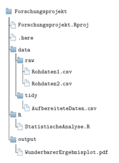

---
output:
  pdf_document: default
  html_document: default
---
#  Datenkunde und Datenaufbereitung {#data}

```{r include=FALSE}
knitr::opts_chunk$set(comment = "#>")
knitr::opts_chunk$set(out.height = '75%', out.width = '75%', fig.align = 'center') 
```

In diesem Kapitel geht es um den auf den ersten Blick unspannendsten Teil der
Forschung: Datenaufbereitung und -management.
Gleichzeitig ist es einer der wichtigsten Schritte: 
ohne Daten können viele Forschungsfragen nicht angemessen beantwortet werden.
Abbildung \@ref(fig:Arbeitsablauf) zeigt den typischen Arbeitsablauf eines 
Forschungsprojekts.

```{r Arbeitsablauf, echo=FALSE, fig.align='center', fig.cap="Typischer Arbeitsablauf eines Forschungsprojekts"}
knitr::include_graphics("figures/chap-data-Ablaufschema.png", auto_pdf = T)
```

In diesem Kapitel liegt der Fokus auf den ersten beiden Abschnitten, der Akquise
und der Aufbereitung Ihrer Daten.
Laut [dieser Umfrage](https://whatsthebigdata.com/2016/05/01/data-scientists-spend-most-of-their-time-cleaning-data/)
verwenden Datenspezialist\*innen regelmäßig 80\% ihrer Arbeitszeit auf diese beiden
Schritte.
Um hier also Zeit und Nerven zu sparen ist es wichtig, 
sich mit den grundlegenden Arbeitsschritten und Algorithmen vertraut zu machen.
Zum Glück ist R sehr gut zur reproduzierbaren Datenaufbereitung geeignet und 
stellt dank vieler hilfreicher Pakete eine große Hilfe in diesem wichtigen 
Prozess dar.

Ein zentrales Anliegen dieses Abschnitts liegt darin, Ihnen Methoden zur 
*reproduzierbaren* und *transparenten* Datenaufbereitung an die Hand zu geben.
Für eine glaubwürdige Forschungsarbeit ist es unerlässlich, dass der Weg von der
Datenerhebung hin zum Forschungsergebnis, also der gesamte Prozess in der obigen
Abbildung, transparent und nachvollziehbar ist.
Daher muss der Datenaufbereitungsprozess gut dokumentiert werden.
Dank skriptbasierter Sprachen wie R ist das im Prinzip ein Kinderspiel.

Wenn Sie nämlich alle Arbeitsschritte nach der Datenerhebung in R durchführen, 
müssen Sie einfach nur Ihre Skripte aufheben - und schon haben Sie die beste 
Dokumentation, die man sich wünschen kann.
Das Wichtigste bei diesem Prozess: Sie dürfen **nie die Rohdaten selbst verändern**.

Alle Änderungen an den Rohdaten müssen durch ein R Skript vorgenommen werden, und
die veränderten Daten müssen unter neuem Namen gespeichert werden. 
Wenn Sie sich das einmal angewöhnt haben, können Sie nicht nur vollkommen 
transparent in Ihrer Forschung sein, Sie können auch nicht aus Versehen und 
unwiderruflich Ihre wertvollen Rohdaten zerstören.

Und wenn Sie sich mit den grundlegenden Algorithmen einmal vertraut gemacht haben
kann Datenaufbereitung wider Erwarten auch wirklich Spaß machen!

Dieses Kapitel folgt dem typischen Arbeitsablauf eines Forschungsprojektes und 
beschäftigt sich mit den ersten beiden Abschnitten aus der obigen Grafik, der
Daten-Akquise und der Daten-Aufbereitung, wobei Letztere im Mittelpunkt stehen
soll.
Entsprechend ist das Kapitel folgendermaßen strukturiert:

Als erstes werden wir uns einen Überblick über die verschiedenen 
[Arten von Daten](#data-arten) verschaffen. 
Danach geht es los mit der [Datenakquise](#data-get). Hier lernen wir, wie man
Daten aus häufig verwendeten Datenbanken direkt über R herunterlädt.
Als nächstes werden Funktionen zum [Lesen und Schreiben von Datensätzen](#data-read-write)
und typische Herausforderungen in diesem Prozess besprochen.
Danach kommt ein sehr umfangreicher Block zum Thema [Datenaufbereitung](#data-wrangling),
in dem Sie lernen, wie Sie Ihre Rohdaten in ein Format überführen, das für die
statistische Analyse geeignet ist.
Zum Abschluss des Kapitels wird noch die 
[Rolle des Datenmanagements für transparente Forschung](#data-role) verdeutlicht 
und auf die Debatten über die Ko-Existenz [verschiedener Pakete für die 
Datenaufbereitung in R](#data-packages) hingewiesen.

## Verwendete Pakete {-}

```{r, message=FALSE, warning=FALSE}
library(countrycode)
library(here)
library(WDI)
library(tidyverse)
library(data.table)
library(R.utils)
library(haven)
```

> **Hinweis**: In diesem Kapitel verwenden wir für die Arbeit mit Daten vor
allem Pakete aus dem sogenannten [tidyverse](https://www.tidyverse.org/).
Ich habe mich für diese Pakete entschieden, weil sie meiner Meinung nach die
für R-Beginner am einfachsten zu lernenden Pakete sind und sie zu sehr einfach
zu lesendem Code führen. 
Zudem sind sie sehr weit verbreitet. 
Es gibt aber auch sehr gute Alternativen und gerade für sehr große Datensätze 
kommen Sie nicht an dem Paket [data.table](https://rdatatable.gitlab.io/data.table/) 
vorbei.
Die Rolle des `tidyverse` und der Debatte um die Pakete in R wird am Ende des
Kapitels beschrieben. 
Bis dahin verweise ich häufig auf weitere Quellen, in denen die Implementierung 
der Arbeitsschritte in anderen Paketen als dem `tidyverse` beschrieben wird.

## Arten von Daten {#data-arten}

Es gibt verschiedene mehr oder weniger konsistente Klassifizierungen von 
Daten, die jeweils auf unterschiedliche Aspekte von Daten oder auch
Variablen abzielen.

Eine sehr prominente Unterscheidung wird zwischen **quantitativen** und 
**qualitativen Daten** getroffen. 
Bei *quantitativen* Daten handelt es sich grob gesagt um *numerische* Daten, also
Daten, die Sie in Zahlen ausdrücken können. 'Größe', 'Preis', 'BIP' oder 'Gehalt'
sind typische Beispiele.
*Qualitative* Daten werden intuitiv *nicht-numerisch* ausgedrückt. 
Häufig handelt es sich um text-basierte oder beschreibende Daten.
In der Praxis werden Sie aber merken, dass die Grenze zwischen quantitativen und
qualitativen Daten häufig deutlich schwammiger ist, als man das auf den ersten 
Blick glauben möchte, denn häufig werden qualitative Beschreibungen 
quantifiziert und dann mit typischen quantitativen Methoden analysiert.
Auch werden sogenannte *mixed methods*-Ansätze immer beliebter, welche qualitative 
und quantitative Methoden kombinieren.

Vor allem in der Psychologie unterscheidet man zwischen **manifesten** und 
**latenten Variablen**.
*Manifeste* Variablen sind direkt beobachtbar und ihre Bedeutung ist häufig 
klar. 
Die *Körpergröße* ist z.B. eindeutig messbar und jede\*r weiß was damit gemeint
ist.

*Latente* Variablen sind **nicht** direkt beobachtbar und sind häufig 
erklärungsbedürftig.
*Nutzen* ist zum Beispiel nicht beobachtbar.^[Das klassische Beispiel in der
Psychologie ist 'Intelligenz'.]
Zudem muss in der Regel erst einmal deutlich gemacht werden, was mit dem Begriff
genau gemeint ist.

Ein großer Teil von Forschungsarbeit ist die **Operationalisierung** einer latenten 
Variable durch eine oder mehrere manifeste Variablen.
Wir sprechen dann davon, dass eine oder mehrere manifeste Variablen als Indikator 
für eine latente Variable verwendet werden.
*Wirtschaftliche Entwicklung* z.B. ist als solche nicht direkt beobachtbar und wird
häufig durch das BIP operationalisiert.^[Interessanterweise hat der maßgeblich an der Entwicklung des Indikators BIP beteiligte Simon Kuznets in @BIP davon abgeraten, diese Operationalisierung
als Indikator für wirtschaftliche Entwicklung zu verwenden.
Für mehr Infos dazu siehe z.B. @BIPHIST.]

Der *Human Development Index* ist der Versuch, wirtschaftliche Entwicklung durch
mehr als eine manifeste Variable zu operationalisieren, also durch beobachtbare
Variablen messbar zu machen.
Eine solche Operationalisierung ist natürlich immer kritisch zu hinterfragen und
ist nicht selten ein Einfallstor für subjektive und manchmal auch manipulative
Wertentscheidungen.

In der Praxis sehr relevant ist zudem die Unterscheidung der 
**vier Skalenniveaus von Daten**, da die Art der Skala bestimmt, 
welche Methode angemessen ist um die Daten zu analysieren. 
Hier wird zwischen **nominal**, **ordinal**, **intervall** und **verhältnis** 
skalierten Daten unterschieden, wobei intervall- und verhältnisskalierte 
Daten häufig unter dem Label **kardinalskalierte** Daten zusammen gefasst werden, 
wie aus der Abbildung \@ref(fig:skalenniveaus) hervorgeht:

```{r skalenniveaus, echo=FALSE, fig.align='center', out.height='100%', fig.cap='Skalenniveaus von Daten'}
knitr::include_graphics("figures/data-data-classification.png", auto_pdf = T)
```

Wir sprechen von **nominalskalierten** Daten wenn wir den einzelnen Ausprägungen
der Daten zwar bestimmte Werte oder eindeutige Beschreibungen zuordnen können, 
diese aber keine natürliche Rangfolge aufweisen.
So können wir einer Person eine Haarfarbe zuordnen, allerdings die verschiedenen
Haarfarben in keine natürliche Rangfolge einordnen. 
Ebenso können wir z.B. Tiere in die Kategorien "Hund", "Katze" und 
"Sonstiges" einordnen, aber eine natürliche Rangfolge dieser Kategorien gibt es
nicht.
Als Konsequenz können wir die einzelnen Ausprägungen zwar zählen, aber sonst keine 
komplexeren mathematischen Operationen - wie z.B. die Berechnung eines Mittelwerts - 
ausführen.

In R werden solche Daten in der Regel als `character` oder als `factor` beschrieben.
In der Regel ist es einfacher die Daten erst als `character` zu erstellen und
dann mit der Funktion `factor()` in Faktoren umzuwandeln:

```{r}
beobachtete_haarfarben <- c("Blond", "Braun", "Schwarz", 
                            "Blond", "Braun", "Braun")
typeof(beobachtete_haarfarben)
beobachtete_haarfarben <- factor(beobachtete_haarfarben)
beobachtete_haarfarben
```

Beachten Sie, dass Faktoren besondere Arten von `integer` sind. 
Um zu testen, ob eine Variable als Faktor kodiert ist, können Sie die Funktion
`is.factor()` verwenden:

```{r}
typeof(beobachtete_haarfarben)
is.factor(beobachtete_haarfarben)
```

Die einzelnen Ausprägungen eines Faktors können mit der Funktion `table` gezählt
werden. Der häufigste wird dabei 'Modus' genannt:

```{r}
table(beobachtete_haarfarben)
```

Mehr Informationen zur Arbeit mit Objekten des Typs `factor` finden Sie
in Abschnitt \@ref(introfactors).

Bei **ordinalskalierten** Daten können die einzelnen Ausprägungen in eine 
klare Rangfolge gebracht werden, aber die Abstände sind nicht sinnvoll 
interpretierbar.
Das klassische Beispiel sind Schulnoten: eine '1' ist besser als eine '2', aber 
weder ist eine 1 'doppelt so gut' wie eine 2, noch sind zwei einser genauso gut
wie eine 2.

Ordinalskalierte Daten werden in R am besten auch als `factor` behandelt, allerdings
müssen Sie die Reihenfolge explizit spezifizieren indem Sie die Level über das
Argument `levels` explizit angeben und dem Argument `ordered` den Wert `TRUE`
übergeben:

```{r}
noten <- c(rep(1, 3), rep(2, 4), rep(3, 6), rep(4, 2), rep(5, 3))
noten
noten <- factor(noten, levels = 1:6, ordered = T)
noten
```

Dass der Faktor geordnet ist erkennen wir daran, dass bei der Auflistung der
Levels das Symbol `<` verwendet wird um die Reihenfolge zu illustrieren.
Um bei bestehenden Faktoren die Reihenfolge zu spezifizieren, verwenden Sie die
Funktion `ordered()` (das und weitere technische Besonderheiten von Objekten des
Typs `factor` werden in Abschnitt \@ref(introfactors) genauer beschrieben):

```{r}
noten <- factor(noten, levels = 1:6, ordered = F)
noten
noten <- ordered(noten, levels = 1:6)
noten
```

Da wir ordinal-skalierte Daten ordnen können, ist es hier z.B. auch möglich 
empirische Quantile zu berechnen. 
Allerdings müssen wir bei der Funktion noch das Argument `type=1` oder `type=3`^[
Eine Beschreibung der unterschiedlichen Algorithmen finden Sie über 
`help(quantile)`.] 
ergänzen, um einen Quantilsalgorithmus zu wählen, der auch mit Faktoren 
funktioniert:

```{r}
quantile(noten, type = 1)
```

Bei **intervallskalierten** Daten können wir die Ausprägungen nicht nur in eine
Rangfolge bringen, sondern auch die Abstände zwischen den Ausprägungen sinnvoll
interpretieren. 
Während es bei Noten also keinen Sinn ergibt, mathematische Operationen wie 'Addition'
oder 'Substraktion' zu verwenden (und die Abstände entsprechend nicht konsistent zu
interpretieren sind), ist dies bei intervallskalierten Daten wie z.B. Jahreszahlen
möglich: 
zwischen 1999 und 2005 liegt der gleiche Abstand wie zwischen 2009 und 2015.
Entsprechend werden intervallskalierte Daten in in der Regel als `integer` oder
`double` gespeichert und wir können Kennzahlen wie den Mittelwert oder die Varianz
berrechnen.

Allerdings verfügen intervallskalierte Daten über keinen absoluten Nullpunkt, 
sodass Divisionen und Multiplikationen keinen Sinn machen. 
Das ist bei **verhältnisskalierten** Daten wie Gewicht, Preis oder Alter anders.
Das kann man am besten an folgendem Beispiel illustrieren:

> **Beispiel: Inverall- vs. verhältnisskalierte Temperaturen**
Wenn wir die Temperatur in Grad Celsius messen haben wir eine Skala ohne absoluten
Nullpunkt. Entsprechend können wir nicht sagen, dass 40 Grad Celsius doppelt 
so warm sind wie 20 Grad Celsius, nur das der Abstand der Gleiche ist wie 
zwischen 10 und 30 Grad Celsius. Das wird deutlich, wenn wir uns fragen ob 10
Grad Celsius doppelt so warm wären wie -10 Grad Celsius.
Eine Lösung ist die Temperatur in Kelvin anzugeben, denn für Kelvin ist ein 
absoluter Nullpunkt definiert. Entsprechend können wir auch sagen, dass 20 
Kelvin halb so warm ist wie 40 Kelvin - wobei beides ziemlich kalt wäre.

Da sowohl intervall- als auch verhältnisskalierte Daten als `double` oder `integer`
repräsentiert werden, ist Vorsicht geboten: wir müssen immer selbst entscheiden
welche Maße wir für die Daten berechnen und R gibt uns keinen Fehler aus, wenn
wir für zwei intervallskalierte Variablen ein Verhältnis berechnen wollen.

Tabelle \@ref(tab:scales) gibt nochmal einen Überblick über die Skalenniveaus 
und die dazugehörigen Objekte.
Wie oben erwähnt bestimmt das Skalenniveau die anwendbaren statistischen Operationen
und Maße. Tabelle \@ref(tab:measures) fasst das für die uns bislang 
bekannten statistischen Maße kurz zusammen. 
Alle diese Konzepte werden im Kapitel \@ref(desk-stat) vertiefter behandelt.

Table: (\#tab:scales) Skalenniveaus und die dazugehörigen R-Objekte.

| **Skalenniveau** | **Beispiel** | **Messbare Eigenschaften** | **Typisches R Objekt** |
|------------------+--------------+----------------------------+------------------------|
| Nominal | Haarfarbe, Telefonnummer | Häufigkeit | `character`, `factor`
| Ordinal | Schulnote, Zufriedenheit | Häufigkeit, Rangfolge | `factor` |
| Intervall | Temperatur in C$^\circ$, Jahreszahl | Häufigkeit, Rangfolge, Abstand  | `integer`, `double` | 
| Verhältnis | Preise, Alter |  Häufigkeit, Rangfolge, Abstand, abs. Nullpunkt | `integer`, `double` | 

Table: (\#tab:measures) Skalenniveaus und die anwendbaren statistischen Operationen.

| | **Nominal** | **Ordinal** | **Intervall** | **Verhältnis** |
|-+:-----------:+:-----------:|:-------------:|:--------------:|
| **Modus** | $\checkmark$ | $\checkmark$ | $\checkmark$ | $\checkmark$ |
| **Quantile** | $\times$ | $\checkmark$ | $\checkmark$ | $\checkmark$ |
| **Interquantilsabstand** | $\times$ | $\checkmark$ | $\checkmark$ | $\checkmark$ |
| **Rankkorrelation** |  $\times$ | $\checkmark$ | $\checkmark$ | $\checkmark$ |
| **Mittelwert** |  $\times$ | $\times$ | $\checkmark$ | $\checkmark$ |
| **Varianz** | $\times$ | $\times$ | $\checkmark$ | $\checkmark$ |
| **Pearson-Korrelation** | $\times$ | $\times$ | $\checkmark$ | $\checkmark$ |

Wahrscheinlich kennen Sie auch noch die Unterscheidung zwischen **diskreten** und
**stetigen** Werten.
Diese Kategorisierungen ist nicht vollkommen konsistent mit den 
Skalenniveaus: zwar sind kardinale Daten in der Tendenz eher stetig und nominale, bzw.
ordinale Daten eher diskret, allerdings gibt es auch diskrete kardinale Daten 
(aber keine stetigen nominalen Daten).

> **Hinweis zum Angeben:** Aus der Skalierung oben wird ersichtlich, dass man 
mit ordinalskalierten Daten keine Durchschnitte bilden darf - man kann sie ja
noch nicht einmal addieren. Ein Bereich wo dieser fundamentalen Regel ständig 
Gewalt angetan wird ist die Schule: wer hat noch nie von einer 
Durchschnittsnote gehört? Zum Glück gehört das an der Universität der 
Vergangenheit an...

## Datenakquise {#data-get}

Der erste Schritt in der Arbeit mit Daten ist immer die Akquise der Daten.
Je nach verwendeter Methode und Fragestellung ist das mehr oder weniger Arbeit.
Im einfachsten Fall sind die von Ihnen benötigten Daten bereits erhoben und 
über das Internet frei zugänglich.
Das trifft z.B. auf viele makroökonomische Indikatoren, wie das BIP, den Gini-Index
oder die Arbeitslosigkeit zu.
In diesem Falle müssen Sie einfach nur noch die passende Quelle finden,^[Das 
bedeutet natürlich weder, dass Sie (a) diesen Daten blind vertrauen sollten, noch dass
(b) Ihre Daten tatsächlich die 
[latente Variable](https://de.wikipedia.org/wiki/Latentes_Variablenmodell)
messen, an der Sie interessiert sind.
Häufig besteht großer Dissens mit welchem Maß welche latente Variable gemessen 
werden kann.
Entsprechend geht der Auswahl der Daten häufig viel Zeit des theoretischen 
Überlegens voraus. Hier gehen wir davon aus, dass Sie sich über die richtigen 
Daten schon im Klaren sind.] laden die Daten herunter und machen beim nächsten
Schritt zum [Einlesen von Datensätzen](#data-read-write) weiter, oder überlegen
ob sie die Daten sogar [direkt mit R herunterladen](#data-download-R) wollen.


### Exkurs 1: Ländercodes übersetzen

Gerade wenn Sie mit makroökonomischen Daten arbeiten werden Sie häufig in Kontakt
mit Ländercodes kommen. 
In vielen Datensätzen werden Länder unterschiedlich abgekürzt.
So mögen manche Datensätze zwar ausgeschriebene Ländernamen wie "Deutschland" 
verwenden, andere verwenden aber eher den 
[iso3c-Code](https://en.wikipedia.org/wiki/ISO_3166-1_alpha-3) 
"DEU", während wieder andere den 
[iso2c-Code](https://en.wikipedia.org/wiki/ISO_3166-1_alpha-2) 
"DE" verwenden.
Wenn Sie sich dann Daten vom IWF herunterladen wundern Sie sich vielleicht, dass
Deutschland dort mit der Zahl `134` kodiert wird.

Zum Glück gibt es ein R-Paket, das die Übersetzung der Codes kinderleicht macht:
`countrycode` [@R-countrycode].
Es stellt Ihnen unter anderem die Funktion `countrycode()` zur Verfügung, mit der
Sie die Codes einfach übersetzen können. Die Funktion benötigt die folgenden 
Argumente:
`sourcevar` akzeptiert einen `character` oder einen Vektor mit den zu 
übersetzenden Ländercodes. 
`origin` gibt die Form dieser Codes an und `destination` spezifiziert den Code
in den Sie die `sourcevar` übersetzen wollen. 
Die Abkürzungen finden Sie in der Hilfefunkion von `countrycode()`.

Nehmen wir einmal an, wir möchten die `iso2c`-Codes für Frankreich und die 
Schweiz herausfinden. Das geht folgendermaßen:

```{r}
countrycode(
  sourcevar = c("Frankreich", "Schweiz"), 
  origin = "country.name.de", 
  destination = "iso3c")
```

In diesem Fall verdeutlicht `origin="country.name.de"`, dass wir die Originalnamen
auf Deutsch angegeben haben und `destination="iso3c"` dass wir in `iso3c`
übersetzen wollen.

Wenn wir wissen wollen welches Land sich hinter der IWF Nummer `112` verbirgt
schreiben wir:

```{r}
countrycode(
  sourcevar = c("112"), 
  origin = "imf",
  destination = "country.name.de")
```

Die Funktion `countrycode()` kennt bereits alle wichtigen Ländercodes. 
Schauen Sie in der Hilfefunktion nach wie die Codes abgekürzt werden.
Grundsätzlich empfehle ich Ihnen in Ihrer Arbeit möglichst auf das Ausschreiben
von Ländernamen zu verzichten und stattdessen mit eindeutigen Kürzeln zu
arbeiten. 
Ich arbeite z.B. immer mit den `iso3c`-Codes, da sie trotz Abkürzung sehr intuitiv
lesbar sind.

Das Problem mit ausgeschriebenen Ländernamen lässt sich anhand der 
Tschechischen Republik gut verdeutlichen. 
Der `iso3c`-Code ist hier eindeutig `CZE`, allerding verwenden manche Datenbanken
den Namen 'Czechia' und andere 'Czech Republik'. 
Das `countrycode`-Paket übersetzt beide Namen in `CZE`:

```{r}
countrycode("Czech Republic", "country.name", "iso3c")
countrycode("Czechia", "country.name", "iso3c")
```

Das kann manchmal zu Problemen beim Zusammenführen von Datensätzen führen, 
da R nicht von sich aus weiß, dass 'Czechia' und 'Czech Republik' das gleiche 
Land bezeichnen. 
Da die Ländercodes immer eindeutig sind empfehle ich daher immer mit den Kürzeln
zu arbeiten und beim ersten Übersetzen immer besonders vorsichtig zu sein.

Das Anwendungsgebiet von `countrycode()` geht übrigens weit über das Übersetzen 
von Länderkürzeln hinaus: manchmal möchten Sie vielleicht eine ganz andere
Übersetzung durchführen. In einem solchen Falle können Sie 
`countrycode()` über das Argument `custom_dict` auch einen `data.frame` mit 
dem neuen Code übergeben und die Funktion ansonsten äquivalent nutzen.
Das kann z.B. passieren wenn Sie Daten von einer Quelle verwenden, die Länder
oder andere Beobachtungen nach einer eigenen Klassifizierung kodiert und diese
Kodierung durch eine eigene Tabelle beschreibt.
Im folgenden Beispiel ist genau das der Fall: wie haben Daten über die Exporte
verschiedener Güterarten. Die Güter sind jedoch nach dem *Harmonized System* 
der UN kodiert (siehe 
[hier](https://unstats.un.org/unsd/tradekb/Knowledgebase/50018/Harmonized-Commodity-Description-and-Coding-Systems-HS)):

```{r, echo=FALSE}
export_data <- data.table::fread(here("data/raw/ComtradeExports.csv"), 
                     colClasses = c("character", "double"))
```
```{r}
head(export_data)
```

Wir können uns aber eine *Korrespondenztabelle* herunterladen, welche die Codes
in konkrete Beschreibungen übersetzt. 
Eine solche Tabelle sieht folgendermaßen aus:

```{r, echo=FALSE}
correspondence_table <- data.table::fread(
  here("data/raw/ComtradeCommodityClassifications.csv"), 
  colClasses = c("character", "character"), nrows = 7)
```
```{r}
head(correspondence_table, 3)
```

Wir können nun die Funktion `countrycode()` zur Übersetzung der Codes in ihre
Beschreibung verwenden (dabei müssen Tabellen in anderen Formaten immer mit
`as.data.frame()` in einen Data Frame umgewandelt werden):

```{r}
export_data <- dplyr::mutate(
  export_data, 
  Good_Description=countrycode(
    Good, "Code", "Description", 
    custom_dict = as.data.frame(correspondence_table)
    )
  )
export_data
```


### Exkurs 2: Daten direkt mit R herunterladen {#data-download-R}

Manchmal können Sie sich viel Arbeit sparen indem Sie die Daten direkt in R
über eine so genannte [API](https://de.wikipedia.org/wiki/Programmierschnittstelle) 
herunterladen.
Das bedeutet, dass Sie über R einen direkten Zugang zum Server mit den Daten
herstellen und die Daten direkt in R einladen.
Das hat den Vorteil, dass die Daten in der Regel bereits in einem gut 
weiterzuverarbeitenden Zustand sind und dass aus Ihrem Code unmittelbar ersichtlich
wird wo Ihre Rohdaten herkommen.^[Da ein solcher Code nur funktioniert wenn Sie 
mit dem Internet verbunden sind und Sie die Daten ja nicht jedes Mal von neuem 
herunterladen wollen macht es Sinn, die Daten nach dem Runterladen abzuspeichern, 
auch um den konkreten Datensatz, mit dem Sie Ihre Ergebnisse bekommen haben, zu 
konservieren.]

Es lohnt sich daher, gerade wenn Sie aus einer Quelle mehrere Daten beziehen wollen,
nachzuschauen ob ein R Paket oder eine besondere API verfügbar ist. 
Im Folgenden möchte ich das Vorgehen mit dem Paket
[WDI](https://github.com/vincentarelbundock/WDI) [@R-WDI] illustrieren, welches Ihnen Zugriff
auf die [Weltbankdaten](https://data.worldbank.org/) ermöglicht.

Das Paket `WDI` stellt Funktionen sowohl zum Suchen als auch zum direkten 
Download von Daten aus der Datenbank der Weltbank zur Verfügung. 
Diese Datenbank ist extrem nützlich, weil sie makroökonomische Indikatoren
für die ganze Welt aus verschiedenen Quellen bündelt.

Als erstes müssen Sie den Code des von Ihnen gewünschten Indikators herausfinden.
Dazu gehen Sie am besten auf die [Startseite](https://data.worldbank.org/)
der Weltbankdatenbank und suchen dort nach den Indikatoren ihrer Wahl.
Nehmen wir einmal an, Sie wollen Daten zum Export und zur Arbeitslosigkeit 
für Deutschland und Österreich für die Jahre 2012-2014 haben. 

Sie suchen also nach den Indikatoren und lesen den Code aus der URL des 
Indikators ab, wie in Abbildung \@ref(fig:WDI) dargestellt:^[Zwar gibt es im `WDI`-Paket auch die Funktion `WDI::WDIsearch()`, 
mit der Sie Datensätze direkt suchen können, allerdings funktioniert das 
meiner Erfahrung nach nicht optimal.]

```{r WDI, echo=FALSE, fig.align='center', fig.cap="Ablesen des Codes aus der URL"}
knitr::include_graphics("figures/chap-data-world-bank.png")
```


Über die Weltbankseite finden Sie heraus, dass die beiden von Ihnen gesuchten 
Indikatoren mit `NE.EXP.GNFS.ZS` und `SL.UEM.TOTL.ZS` kodiert sind.
Nun verwenden Sie die Funktion `WDI::WDI()` um direkt auf die Daten zuzugreifen.
Die Funktion benötigt dabei die folgenden Argumente:
`country` verlangt nach einem Vektor mit Länderkürzeln. 
Der `countrycode`-Code für die von der Weltbank geforderten Kürzel ist `wb` und
es ist entsprechend einfach diesen Vektor zu erstellen.
Das zweite relevante Argument ist `indicator` und benötigt einen Vektor der 
gewünschten Indikatoren.
Über die Argumente `start` und `stop` geben Sie das erste und letzte gewünschte
Beobachtungsjahr an.
Die weiteren Argumente sind nicht von unmittelbarem Interesse.

Nun können Sie die Funktion `WDI::WDI()` folgendermaßen verwenden um Export- 
und Arbeitslosendaten für Deutschland und Österreich zwischen 2012 und 2014 zu
bekommen:

```{r, eval=FALSE}
t_beginn <- 2012
t_ende <- 2014
laender <- countrycode(c("Germany", "Austria"), 
                       "country.name", "wb")
indikatoren <- c("NE.EXP.GNFS.ZS", "SL.UEM.TOTL.ZS")

daten <- WDI::WDI(
  country = laender, 
  indicator = indikatoren
  start = t_beginn,
  end = t_ende
)
```
```{r, echo=FALSE}
daten <- data.table::fread(here("data/tidy/wb_example.csv"))
```
```{r}
daten
```

Mit derlei Paketen können Sie sich häufig viel Zeit sparen, insbesondere wenn
Sie mehrere Datensätze von der gleichen Quelle benötigen.

## Daten einlesen und schreiben {#data-read-write}

### Einlesen von Datensätzen

Wenige Arbeitsschritte können so frustrierend sein wie das Einlesen von Daten.
Sie können sich gar nicht vorstellen was hier alles schiefgehen kann! 
Aber kein Grund zur übertriebenen Sorge: 
wir können viel Frustration vermeiden wenn wir am Anfang unserer Karriere 
ausreichend Zeit in die absoluten Grundlagen von Einlesefunktionen investieren.
Also, auch wenn die nächsten Zeilen etwas trocken wirken: sie werden Ihnen
später viel Zeit ersparen!

Das am weitesten verbreitete Dateiformat ist csv.
'csv' steht für 'comma separated values' und diese Dateien sind einfache 
Textdateien, in denen Spalten mit bestimmten Symbolen, in der Regel einem Komma,
getrennt sind.
Aufgrund dieser Einfachheit sind diese Dateien auf allen Plattformen und quasi 
von allen Programmen ohne Probleme lesbar.

In R gibt es verschiedene Möglichkeiten csv-Dateien einzulesen.
Die mit Abstand beste Option ist dabei die Funktion `data.table::fread()` aus dem Paket 
`data.table`, da sie nicht nur sehr flexibel spezifiziert werden kann, sondern
auch deutlich schneller als andere Funktionen arbeitet.

Wir gehen im Folgenden davon aus, dass wir die Datei `data/tidy/export_daten.csv`
einlesen wollen.
Die Datei sieht folgendermaßen aus:

```
iso2c,year,Exporte
AT,2012,53.97
AT,2013,53.44
AT,2014,53.38
```

Es handelt sich also um eine sehr standardmäßige csv-Datei, die wir einfach 
mit der Funktion `data.table::fread()` einlesen können. 
Dazu übergeben wir `data.table::fread()` nur das einzige wirklich notwendige Argument:
den Dateipfad. 
Der besseren Übersicht halber sollte dieser immer separat definiert werden:

```{r}
daten_pfad <- here("data/tidy/export_daten.csv")
daten <- data.table::fread(daten_pfad)
daten
```

Vielleicht fragen Sie sich wie `data.table::fread()` die Spalten bezüglich ihres 
[Datentyps](#basics-types-vectors) interpretiert hat?
Das können wir folgendermaßen überprüfen:

```{r}
typeof(daten$year)
```

In der Regel funktioniert die automatische Typerkennung von `data.table::fread()` sehr gut.
Ich empfehle dennoch die Typen im Zweifel manuell zu spezifizieren, aus folgenden 
Gründen: (1) Sie merken leichter wenn es mit einer Spalte ein Problem gibt,
z.B. wenn in einer Spalte, die ausschließlich aus Zahlen besteht ein Wort 
vorkommt. Wenn Sie diese Spalte nicht manuell als `double` spezifizieren würden, 
würde `data.table::fread()` sie einfach still und heimlich als `character` interpretieren und Sie
wundern sich später, warum Sie für die Spalte keinen Durchschnitt berechnen können;
(2) Ihr Code wird leichter lesbar; und (3) der Einlesevorgang wird deutlich 
beschleunigt da `data.table::fread()` die Typen nicht selbst 'erraten' muss.

Sie können die Spaltentypen manuell über das Argument `colClasses` einstellen, 
indem Sie einfach einen Vektor mit den Datentypen angeben:

```{r}
daten_pfad <- here("data/tidy/export_daten.csv")
daten <- data.table::fread(daten_pfad, 
               colClasses = c("character", "double", "double"))
typeof(daten$year)
```

Da es bei sehr großen Dateien einen extremen Unterschied macht ob Sie die 
Spaltentypen angeben oder nicht macht es in einem solchen Fall häufig Sinn, 
zunächst mal nur die erste Zeile des Datensatzes einzulesen, sich 
anzuschauen welche Typen die Spalten haben sollten und dann den gesamten 
Datensatz mit den richtig spezifizierten Spaltentypen einzuladen.
Sie können nur die erste Zeile einladen indem Sie das Argument `nrows` 
verwenden:

```{r}
daten_pfad <- here("data/tidy/export_daten.csv")
daten <- data.table::fread(daten_pfad, 
               colClasses = c("character", "double", "double"),
               nrows = 1)
daten
```

Manchmal möchten Sie auch nur eine bestimmte Auswahl an Spalten einlesen.
Auch das kann bei großen Datensätzen viel Zeit sparen.
Wenn wir nur das Land und die Anzahl der Exporte haben wollen, spezifizieren wir
das über das Argument `select`:

```{r}
daten_pfad <- here("data/tidy/export_daten.csv")
daten <- data.table::fread(daten_pfad, 
               colClasses = c("character", "double", "double"),
               nrows = 1, 
               select = c("iso2c", "Exporte"))
daten
```

Die Beispiel-Datei oben war sehr angenehm formatiert. Häufig werden aber andere
Spalten- und Dezimalkennzeichen verwendet.
Gerade in Deutschland ist es verbreitet, Spalten mit `;` zu trennen und das 
Komma als Dezimaltrenner zu verwenden. 
Unsere Beispiel-Datei oben sähe dann so aus:

```
iso2c;year;Exporte
AT;2012;53,97
AT;2013;53,44
AT;2014;53,38
```

Zum Glück können wir das Spaltentrennzeichen über das Argument `sep` und das 
Kommatrennzeichen über das Argument `dec` manuell spezifizieren:^[Auch hier gilt,
dass die automatische Erkennung von `data.table::fread()` schon sehr gut funktioniert, aber
die manuelle Eingabe immer sicherer und transparenter ist.]

```{r}
daten_pfad <- here("data/tidy/export_daten_dt.csv")
daten <- data.table::fread(daten_pfad, 
               colClasses = c("character", "double", "double"), 
               sep = ";", 
               dec = ","
               )
daten
```

`data.table::fread()` verfügt noch über viele weitere Spezifizierungsmöglichkeiten, mit denen Sie
sich am besten im konkreten Anwendungsfall vertraut machen.
Auch ein Blick in die Hilfeseite ist recht illustrativ. 
Für die meisten Anwendungsfälle sind Sie jetzt aber gut aufgestellt.

> **Anmerkungen zu komprimierten Dateien:** Häufig werden Sie auch komprimierte 
Dateien einlesen wollen. Gerade komprimierte csv-Dateien kommen häufig vor.
In den meisten Fällen können Sie diese Dateien direkt mit `data.table::fread()` einlesen.
Falls nicht, können Sie `data.table::fread()` aber auch dem entsprechenden UNIX-Befehl zum 
Entpacken als Argument `cmd` übergeben, also z.B. 
`data.table::fread("unzip -p data/gezipte_daten.csv.bz2")`. Weitere Informationen finden
Sie sehr einfach im Internet.

Auch wenn csv-Dateien die am weitesten verbreiteten Daten sind: 
es gibt natürlich noch viele weitere Formate mit denen Sie in Kontakt kommen werden.
Hier möchte ich exemplarisch auf drei weitere Formate (`.rds`, `.rdata` und 
`.dta`) eingehen:

R verfügt über zwei 'hauseigene' Formate, die sich extrem gut zum Speichern von
größeren Daten eignen, aber eben nur von R geöffnet werden können. 
Diese Dateien enden mit `.rds`, bzw. mit `.RData` oder `.Rda`, wobei `.Rda`
nur eine Abkürzung für `.RData` ist.

Dabei gilt, dass `.rds`-Dateien einzelne R-Objekte enthalten, z.B. einen 
einzelnen Datensatz, aber auch jedes andere Objekt (Vektor, Liste, etc.) 
kann als `.rds`-Dateie gespeichert werden.
Solche Dateien können mit der Funktion `readRDS()` gelesen werden, die als
einziges Argument den Dateinamen annimmt:

```{r}
daten_pfad <- here("data/tidy/export_daten.rds")
daten <- readRDS(daten_pfad)
daten
```

`.RData`-Dateien können auch mehrere Objekte enthalten. 
Zudem gibt die entsprechende Funktion `load()` kein Objekt aus, dem Sie einen
Namen zuweisen können. 
Vielmehr behalten die Objekte den Namen, mit dem sie ursprünglich gespeichert
wurden.
In diesem Fall wurden in der Datei `data/tidy/test_daten.RData` der Datensatz
`test_dat` und der Vektor `test_vec` gespeichert.
Entsprechend sind sie nach dem Einlesen verfügbar:

```{r, echo=FALSE}
test_dat <- data.frame(a=1:2, b=3:4)
test_vec <- "Test Vektor"
save(list=c("test_dat", "test_vec"), 
     file=here("data/tidy/test_daten.RData"))
```
```{r}
load(here("data/tidy/test_daten.RData"))
test_dat
test_vec
```

Die Verwendung von `.RData` ist besonders dann hilfreich, wenn Sie mehrere 
Objekte speichern wollen und wenn einige dieser Objekte keine Datensätze sind, 
für die auch andere Formate zur Verfügung stehen.

Ein in der Ökonomik häufig verwendetes Format ist das von der Software 
[STATA](https://de.wikipedia.org/wiki/Stata) verwendete Format `.dta`.
Um Dateien in diesem Format lesen zu können verwenden Sie die Funktion
`read_dta()` aus dem Paket [haven](https://github.com/tidyverse/haven) [@R-haven], 
die als einziges Argumente den Dateinamen akzeptiert:

```{r}
dta_datei <- here("data/tidy/export_daten.dta")
dta_daten <- read_dta(dta_datei)
head(dta_daten, 2)
```

Das Paket [haven](https://github.com/tidyverse/haven) stellt auch Funktionen zum 
Lesen von SAS oder SPSS-Dateien bereit.

### Speichern von Daten

```{r, echo=FALSE}
test_data <- data.frame(
  Land = c("DEU", "DEU"),
  Jahr = c(2011:2012),
  BIP = c(1,2)
)
```


Im Vergleich zum Einlesen von Daten ist das Speichern deutlich einfacher, weil
sich die Daten ja bereits in einem vernünftigen Format befinden. 
Die größte Frage hier ist also: in welchem Dateiformat sollten Sie Ihre Daten 
speichern?

In der großen Mehrheit der Fälle ist diese Frage klar mit `.csv` zu beantworten.
Dieses Format ist einfach zu lesen und absolut plattformkompatibel.
Es hat auch nicht die schlechtesten Eigenschaften was Lese- und Schreibgeschwindigkeit
angeht, insbesondere wenn man die Daten komprimiert.

Die schnellste und meines Erachtens mit Abstand beste Funktion zum Schreiben von
csv-Dateien ist die Funktion `fwrite()` aus dem Paket `data.table`.
Angenommen wir haben einen Datensatz `test_data`, den wir im Unterordner 
`data/tidy` als `test_data.csv` speichern wollen.
Das geht mit `fwrite()` ganz einfach:

```{r, eval=FALSE}
datei_name <- here("data/tidy/test_data.csv")
fwrite(test_data, file = datei_name)
```

Neben dem zu schreibenden Objekt als erstem Argument benötigen Sie noch das 
Argument `file`, welches den Namen und Pfad der zu schreibenden Datei spezifiziert. 
Der Übersicht halber ist es oft empfehlenswert diesen Pfad zuerst als 
`character`-Objekt zu speichern und dann an die Funktion `fwrite()` zu übergeben.

`fwrite()` akzeptiert noch einige weitere optionale Argumente, die Sie im 
Großteil der Fälle aber nicht benötigen. 
Schauen Sie bei Interesse einfach einmal in die Hilfefunktion!

Falls Ihr Datensatz im csv-Format doch zu groß ist, Sie aber aufgrund von
Kompatibilitätsanforderungen kein spezialisiertes Format benutzen wollen, bietet
es sich an die csv-Datei zu komprimieren. 
Natürlich könnten Sie das händisch in Ihrem Datei-Explorer machen, aber das ist vollkommen überholt. 
Sie können das gleich in R miterledigen indem Sie z.B. die Funktion `gzip`
aus dem Paket `R.utils` [@R-R.utils] verwenden:

```{r, eval=FALSE}
csv_datei_name <- here("data/tidy/test_data.csv")
fwrite(test_data, file = csv_datei_name)
gzip(csv_datei_name,
      destname=paste0(csv_datei_name, ".gz"), 
      overwrite = TRUE, remove=TRUE)
```

Diese Funktion akzeptiert als erstes Argument den Pfad zu der zu komprimierenden
Datei, also zweites Argument (`destname`) den Namen, den die komprimierte Datei
tragen soll und einige weitere optionale Argumente. Häufig bietet sich
`overwrite = TRUE` an, um alte Versionen der komprimierten Datei im Zweifel zu
überschreiben, und `remove=TRUE` um die un-komprimierte Datei nach erfolgter
Komprimierung zu löschen.

> **Hinweise zu verschiedenen zip-Formaten:** Die Funktion `gzip()` komprimiert
eine Datei mit dem [GNU zip Algorithmus](https://de.wikipedia.org/wiki/Gzip). 
Die resultierende komprimierten Dateien sollten mit der zusätzlichen Endung `.gz` 
gekennzeichnet werden. `gzip()` ist eine relativ schnell arbeitende Funktion, 
allerdings mit mäßigen Kompressionseigenschaften.
Wenn Sie bereit sind längere Arbeitszeit für ein besseres Kompressionsergebnis
in Kauf zu nehmen, sollten Sie sich die Funktion `bzip2()` ansehen, welche den 
[bzip2-Algorithmus](https://de.wikipedia.org/wiki/Bzip2) implementiert. 
Dieser hat eine deutlich bessere Kompressionsrate (die komprimierten Dateien sind
also deutlich kleiner), allerdings ist `bzip2()` auch deutlich langsamer als `gzip()`.
Dateien, die mit `bzip2()` komprimiert wurden, sollten mit der Endung `.bz2` 
gekennzeichnet werden. Entsprechend sieht der Code von oben mit `bzip2()`
anstatt `gzip()` folgendermaßen aus:

```{r, eval=FALSE}
csv_datei_name <- here("data/tidy/test_data.csv")
fwrite(test_data, csv_datei_name)
bzip2(csv_datei_name,
      destname=paste0(csv_datei_name, ".bz2"), 
      overwrite = TRUE)
```

> Einen Vergleich der Kompressionseigenschaften und Lese- und Schreibgeschwindigkeiten
ist immer auch kontextabhängig, im Internet finden sich viele Diskussionen zu dem
Thema. Am Anfang sind Sie mit `gzip()` und `bzip2()` aber eigentlich für alle
relevanten Fälle gut aufgestellt.

Die oben bereits vorgestellten R-spezifischen Formate `.Rdata` und `.rds` verfügen 
über deutliche Geschwindigkeits- und Komprimierungsvorteile gegenüber dem csv-Format 
und sind dabei trotzdem vollkommen plattformkompatibel.
Einziger Nachteil: 
alle Irren, die nicht R benutzen, können Ihre Daten nicht öffnen.
Manchmal mag das eine verdiente Strafe, manchmal aber auch ein Ausschlusskriterium
sein.

```{r}
saveRDS(object = test_data,  file = here("data/tidy/export_daten.rds"))
```

Wie Sie sehen sind zwei Argumente zentral: das erste Argument, `object` 
spezifiziert das zu speichernde Objekt und `file` den Dateipfad.
Darüber hinaus können Sie mit dem optionalen Argument `compress` hier die 
Kompressionsart auswählen. Ähnlich wie oben gilt, dass `gz` am schnellsten und 
`bz` am stärksten ist. `xz` liegt in der Mitte.

Wenn Sie mehrere Objekte auf einmal speichern möchten können Sie das über das 
Format `.RData` machen.
Die entsprechende Funktion ist `save()`.
Zwar können Sie einfach alle zu speichernden Objekte als die ersten 
Argumente an die Funktion übergeben, es ist aber übersichtlicher das
über das Argument `list` zu erledigen.
Der folgende Code speichert die beiden Objekte `test_data` und `daten` in der
Datei `"data/tidy/datensammlung.Rdata"`:

```{r}
save(list=c("test_data", "daten"), 
     file=here("data/tidy/datensammlung.RData"))
```

Wie `saveRDS()` können Sie bei `save()` über das Argument `compress` den 
Kompressionsalgorithmus auswählen, 
allerdings können Sie mit `compression_level` zusätzlich noch die Stärke von `1` 
(schnell, aber wenig Kompression) bis `9` (langsamer, aber starke Kompression) 
auswählen.

Da, wie oben erwähnt, gerade in der Ökonomik auch häufig mit der kostenpflichtigen Software 
[STATA](https://de.wikipedia.org/wiki/Stata) gearbeitet wird, möchte ich noch 
kurz erkläutern, wie man einen Datensatz im STATA-Format `.dta` speichern kann. 
Dazu verwenden wir die Funktion `write_dta()`
aus dem Paket [haven](https://github.com/tidyverse/haven).

```{r, eval=FALSE}
library(haven)
write_dta(test_data, 
          here("data/tidy/test_daten.dta"))
```

Für `SAS`- und `SPSS`-Daten gibt es ähnliche Funktionen, die ebenfalls durch das
[haven](https://github.com/tidyverse/haven)-Paket bereitgestellt werden.

> **Hinweis:** Gerade bei großen Datensätzen kommt es wirklich sehr auf die Lese- und 
Schreibgeschwindigkeit von Funktionen an. Auch stellt sich hier die Frage nach
dem besten Dateiformat noch einmal viel deutlicher als das bei kleinen Datensätzen
der Fall ist und sich die Formatfrage vor allem um das Thema 'Kompatibilität' 
dreht. Einige nette Beiträge, die verschiedene Funktionen und Formate bezüglich
ihrer Geschwindigkeit vergleichen finden Sie z.B. 
[hier](https://csgillespie.github.io/efficientR/efficient-inputoutput.html) oder  
[hier](https://data.nozav.org/post/2019-r-data-frame-benchmark/).

## Verarbeitung von Daten ('data wrangling') {#data-wrangling}

Nachdem Sie Ihre Daten erhoben haben, müssen Sie die Rohdaten in eine Form 
bringen, mit der Sie sinnvoll weiterarbeiten können.
Dieser Prozess wird oft als 'Datenaufbereitung' bezeichnet und stellt häufig 
einen der zeitaufwendigsten Arbeitsschritte in der Forschungsarbeit dar:
Laut [dieser Umfrage](https://whatsthebigdata.com/2016/05/01/data-scientists-spend-most-of-their-time-cleaning-data/)
macht es sogar 60 \% der Arbeitszeit von Datenspezialist\*innen aus.
Entsprechend wichtig ist es, sich mit den typischen Arbeitsschritten und 
Algorithmen vertraut zu machen um in diesem aufwendigen Arbeitsschritt Zeit zu
sparen.

Ein großes Problem in der Forschungspraxis ist häufig, dass Forscher\*innen den
Datenaufbereitungsprozess nicht richtig dokumentieren. 
In diesem Fall ist unklar was für Änderungen an den Rohdaten vorgenommen wurden
bevor die eigentliche Analyse begonnen wurde.
Das führt zu unreproduzierbarer und intransparenter Forschung.
Daher ist es wichtig, alle Änderungen, die Sie im Rahmen der Datenaufbereitung
vornehmen zu dokumentieren. 

Am einfachsten ist es, für die Datenaufbereitung einfach ein R-Skript zu schreiben,
in dem Sie die Rohdaten einlesen und am Ende die aufbereiteten Daten unter neuem
Namen speichern. 
Am besten legen Sie in Ihrem Ordner `data` zwei Unterordner an:
Die Rohdaten speichern Sie dann in einem Unterordner `raw`, die bearbeiteten und 
aufbereiteten Daten in einem Unterordner `tidy`.
So behalten Sie immer den Überblick.
**Nie** sollten Sie Ihre Rohdaten überschreiben!
Damit sind Sie in Ihrer Forschung vollkommen transparent und es entsteht Ihnen 
im Prinzip keine Mehrarbeit (siehe Abbildung \@ref(fig:rawtidy)).


```{r rawtidy, echo=FALSE, fig.align='center', out.width='40%', fig.cap='Eine übersichtliche Art und Weise Ihre Daten zu speichern. Die Dateien im Unterordner `raw` werden nie geändert. Die Datei `exports-tidy` im Ordner `tidy` wurde mit dem Skript `exports-preparation.R` aus dem Rohdatensatz `exports-raw.csv` erstellt.'}
knitr::include_graphics(here("figures/chap-data-raw-tidy.png"), auto_pdf = T)
```

In diesem Abschnitt lernen Sie Lösungen für Probleme, 
die typischerweise während der Datenaufbereitung auftreten. 
Dafür beschäftigen wir uns zunächst mit dem gewünschten Ergebnis: sogenannter
[tidy data](#data-tidy-data). 
Diese Art von Datensätzen sollte das Ergebnis jeder Datenaufbereitung sein.

Auf dem Weg zu *tidy data* bedarf es häufig einer 
[Transformation von langen und breiten Datensätzen](#data-long-wide).
Außerdem werden Sie häufig mehrere 
[Datensätze zusammenführen](#data-merge-data) und Ihre 
[Daten filtern, selektieren und aggregieren](#data-select).
Zudem möchten Sie manchmal Daten auch [reduzieren und zusammenfassen](#data-summary).

> **Beispiel für berühmte Menschen mit miserabler Datenaufbereitung: Der Reinhart-Rogoff Skandal**  
Eines der dramatischsten Beispiele für Fehler in der Datenaufbereitung mit 
katastrophalen realweltlichen Implikationen ist der 
[Reinhart-Rogoff-Skandal](https://www.newyorker.com/news/john-cassidy/the-reinhart-and-rogoff-controversy-a-summing-up).
Carmen Reinhart und Kenneth Rogoff haben in ihrem einflussreichen Paper
[Growth in a Time of Debt](http://scholar.harvard.edu/files/rogoff/files/growth_in_time_debt_aer.pdf)
einen negativen Effekt von übermäßiger Staatsverschuldung auf wirtschaftliches
Wachstum festgestellt.
Als der PhD-Student [Thomas Herndon](https://en.wikipedia.org/wiki/Thomas_Herndon)
während eines Seminars das Paper replizieren sollte, bekam er Probleme.
Dankenswerterweise sendete ihm Carmen Reinhard den Datensatz zu, allerdings
stellte sich heraus, dass durch einen Excel-Fehler einige Länder aus der 
Stichprobe gefallen waren. Mit der kompletten Stichprobe löste sich der im
ursprünglichen Paper identifizierte Zusammenhang auf [@Herndon].
Das ist besonders dramatisch, da das Paper nicht nur zahlreiche Preise gewonnen
hat, sondern auch als wichtige Begründung für die in Europa implementierte
Austeritätspolitik fungierte.
Klar ist: wäre der Datenaufbereitungsprozess transparent und offen durchgeführt 
und dokumentiert worden, wäre der Fehler wahrscheinlich deutlich einfacher und 
früher gefunden worden.

### Das Konzept von 'tidy data'

Die Rohdatensätze, die wir erheben oder aus dem Internet herunterladen haben 
oft eine abenteuerliche Form und wir können in der Regel nicht direkt mit der
statistischen Analyse anfangen. 
Die meisten Statistik-Pakete und Funktionen setzen eine bestimmte 'aufgeräumte'
Form der Daten voraus. @tidy beschreibt diese Form als `tidy data`^[Wie 
[hier beschrieben](http://www.win-vector.com/blog/2019/05/what-is-tidy-data/)
ist das Konzept von 'tidy data' nicht neu:
Statistiker\*innen sprechen bei einem 'tidy' Datensatz häufig von einer
'Datenmatrix'. Wer sich mehr mit der zugrundeliegenden Theorie beschäftigen
möchte sollte zunächst die 
[12 Regeln von Edgar Codd](https://en.wikipedia.org/wiki/Codd%27s_12_rules) und
ihre Begründung nachlesen.] und es ist unser Ziel durch die Datenaufbereitung die
verschiedenen Rohdatensätze in `tidy data` zu verwandeln. Die daraus resultierenden
Datensätze können dann separat gespeichert werden, damit wir die Datenaufbereitung
nicht jedes Mal erneut durchführen müssen (im Abschnitt 
[Abschließende Bemerkungen](#data-final-thoughts) wird ein entsprechender 
Vorschlag für eine hilfreiche Ordnerstruktur beschrieben).

Aber was zeichnet `tidy data` aus? Wie von @tidy beschrieben kann ein Datensatz
auf vielerlei Art und Weise 'unordentlich' sein, aber nur auf eine Art und Weise
'tidy'. Ein 'tidy' Datensatz ist durch folgende drei Eigenschaften gekennzeichnet:

1. Jede **Spalte** korrespondiert zu genau einer **Variable**
2. Jede **Zeile** korrespondiert zu genau einer **Beobachtung**
3. Jede **Zelle** korrespondiert zu einem einzelnen **Wert**

Punkt (1) verlangt, dass jede Spalte zu einer Variable korrespondiert und es keine
Spalten gibt, die zu keiner Variable korrespondieren. 
Wenn wir also Daten zum BIP in verschiedenen Ländern über die Zeit erheben 
impliziert das, dass wir es mit drei Variablen zu tun haben: dem `Land`, dem 
`Jahr` und dem `BIP`. Entsprechend sollte unser Datensatze genau drei Spalten
haben, die jeweils zu diesen Variablen korrespondieren.

Punkt (2) verlangt, dass jede Zeile zu genau einer Beobachtung korrespondiert.
In unserem Beispiel sollte also jede Zeile zu der Beobachtung des BIP in genau
einem Land zu genau einem Zeitraum korrespondieren - und z.B. nicht die Beobachtungen
für ein einziges Land zu allen möglichen Zeiträumen sammenln.

Punkt (3) ist meistens in unseren Anwendungsfällen ohnehin erfüllt. 
Er verlangt, dass jede Zelle in unserem Datensatz genau einen Wert enthält, und 
z.B. nicht nochmal eine Liste mit mehreren Werten, wie es ja bei einem 
`data.frame` auch 
[möglich wäre](https://ryouready.wordpress.com/2016/07/18/populating-data-frame-cells-with-more-than-one-value/).

> **Beispiel 'tidy data'**: Der folgende Datensatz ist 'tidy' im gerade 
beschriebenen Sinn:

```{r, echo=FALSE}
exports_unemp_data_tidy <- data.table::fread(here("data/tidy/wb_example.csv")) %>%
  rename(Land=iso2c, 
         Jahr=year,
         Exporte=NE.EXP.GNFS.ZS, 
         Arbeitslosigkeit=SL.UEM.TOTL.ZS) %>%
  filter(Jahr>2012) %>%
  select(-country)
```


```{r, echo=FALSE}
exports_unemp_data_tidy
```

> Wir haben vier Spalten, die jeweils zu einer der vier Variablen `Land`, `Jahr`, 
`Exporte` und `Arbeitslosigkeit` korrespondieren. 
Jede Zeile korrespondiert zur Beobachtung von `BIP` und `Exporte` in
genau einem Jahr in genau einem Land. Und die einzelnen Zellen enthalten genau
einen Wert, jeweils für das Land, das Jahr, die Exporte und die Arbeitslosigkeit.

> **Beispiel: Verstoß gegen (1) **: Der folgende Datensatz, welcher nur Informationen
zu den Exporten und für das Jahr 2014 enthält, ist nicht 'tidy', da er gegen 
Anforderung (1) verstößt:

```{r, echo=FALSE}
exports_unemp_data_untidy_1 <- exports_unemp_data_tidy %>%
  select(-Arbeitslosigkeit) %>%
  filter(Jahr==2014) %>%
  gather(Variable, value, -Land, -Jahr) %>%
  spread(Jahr, value)
exports_unemp_data_untidy_1
```

> Hier haben wir drei Variablen, `Land`, `Jahr` und `Exporte`, aber die Spalte 
`2013` korrespondiert zu einer Ausprägung der Variable
`Jahr`, aber nicht zur Variablen als solchen. 
Die Bedeutung dieser Unterscheidung wird im nächsten Beispiel deutlich.

> **Beispiel: Verstoß gegen (1) und (2):**
Wenn wir in dem ersten Datensatz alle Informationen belassen, 
würde er in der gerade dargestellten Form sowohl gegen (1) als auch (2) verstoßen:

```{r, echo=FALSE}
exports_unemp_data_untidy_2 <- exports_unemp_data_tidy %>%
  gather(Variable, value, -Land, -Jahr) %>%
  spread(Jahr, value)
exports_unemp_data_untidy_2
```

> Jetzt ist nicht nur die Anforderung, dass jede Spalte zu einer Variable korrespondiert,
verletzt, sondern auch die Anforderung, dass jede Zeile zu genau einer Beobachtung
korrespondiert, da wir wegen der zwei Jahre in jeder Zeile zwei Beobachtungen haben.
Ebenfalls sehr häufig kommt folgendes Format vor, das ebenfalls (1) und (2) 
widerspricht:

```{r, echo=FALSE}
exports_unemp_data_untidy_3 <- exports_unemp_data_tidy %>%
  gather(Variable, Wert, -Land, -Jahr) 
exports_unemp_data_untidy_3
```

> **Beispiel: Verstoß gegen (3)** Verstöße gegen die dritte Anforderung
kommen in der Praxis in der Regel seltener vor, sind aber auch unschön:

```{r}
d <- data.frame(Land=c("DE", "AT"))
d$`Wichtige Industrien` <-  list(c("Autos", "Medikamente"), c("Stahlproduktion", "Holz"))
d
```


### Von langen und breiten Datensätzen {#data-long-wide}

Die Datenaufbereitung umfasst häufig das Wechseln zwischen der so genannten 
'langen' (oder 'gestapelten') und 'breiten' ('ungestapelten') Datenform.
Die erste ist für die statistische Verarbeitung, die zweite für das 
menschliche Auge besser geeignet.

'Lange' Daten haben in der Regel viele Zeilen und wenige Spalten. 
Alle `tidy` Datensätze sind im langen Datenformat. 'Breite' Daten haben
mehr Spalten und weniger Zeilen und sind häufig das, was wir aus dem
Internet herunterladen. Im Folgenden ist der gleiche Datensatz einmal im 
langen und einmal im breiten Format dargestellt.

Zuerst das 'lange' Format, in dem wir verhältnismäßig viele Zeilen haben:

```{r, echo=FALSE}
exports_unemp_data_tidy %>%
  select(-Arbeitslosigkeit)
  
```

Und hier das 'breite' Format mit verhältnismäßig mehr Spalten:

```{r, echo=FALSE}
exports_unemp_data_tidy %>%
  select(-Arbeitslosigkeit) %>%
  gather(Variable, Werte, -Land, -Jahr) %>%
  spread(Jahr, Werte)
```

Häufig werden Sie während Ihrer Datenaufbereitung mehrmals zwischen den beiden
Formaten hin und her wechseln, da für manche statistischen Zwischenschritte das 
eine, für andere das andere Format besser ist.^[Das steht nicht im Widerspruch
zu dem oben formulierten Ziel am Ende `tidy` Daten zu haben. Es ist nur so, 
dass Sie für manche statistischen Transformationen als Zwischenschritt in
ein anderes Format wechseln müssen, oder der Weg hin zu `tidy` Daten das 
Wechseln zwischen langen und breiten Datensätzen erforderlich macht. Das wird
durch die Beispiele später in diesem Kapitel praktisch deutlich werden.]

Um zwischen den Formaten hin und herzuwechseln verwenden wir vor allem die 
Funktionen `pivot_longer()` und `pivot_wider()` aus dem Paket 
[tidyr](https://github.com/tidyverse/tidyr) [@R-tidyr], welches auch Teil des 
`tidyverse` ist.^[Die Funktionen `pivot_longer()` und `pivot_wider()` wurden in 
der neuesten Version von `tidyr` eingeführt. Achten Sie also darauf, dass Sie 
die neueste Version installiert haben. Sie ersetzen die Funktionen `spread()` und 
`gather()`, die natürlich noch weiterhin funktionieren und die Sie in älterem Code 
sicher noch häufig finden werden. 
In diesem [Blog-Post](https://www.tidyverse.org/blog/2019/09/tidyr-1-0-0/)
beschreibt Chefentwickler Hadley Wickham die neuen Funktionen und grenzt sie
von den älteren Implementierungen ab.]

Wir verwenden `pivot_longer()` um einen Datensatz 'länger' zu machen.
Wir verwenden dazu folgenden Datensatz als Ausgangsbeispiel, der Werte
für die Arbeitslosigkeit in Deutschland und Österreich in zwei Jahren 
enthält:

```{r, echo=FALSE}
data_wide <- exports_unemp_data_tidy %>%
  select(-Exporte) %>%
  gather(Variable, Werte, -Land, -Jahr) %>%
  spread(Jahr, Werte) %>%
  select(-Variable)
```
```{r}
data_wide
```

Das erste Argument für `pivot_longer()` heißt `data` und nimmt den Datensatz, 
den wir länger machen wollen. In unserem Beispiel also `data_wide`.

Das zweite Argument heißt `cols` und beschreibt die Spalten an denen Änderungen 
vorgenommen werden sollen. 
In unserem Falle sind das die Spalten `2013` und `2014`.
Um hier eine Liste von Spaltennamen zu übergeben verwenden wir die Hilfsfunktion
`one_of()`, die es uns erlaubt die Spaltennamen als `character` zu schreiben.
Das Argument wird also als `cols=one_of("2013", "2014")` spezifiziert.

Das dritte Argument, `names_to` akzeptiert einen `character`, der den Namen der
neu zu schaffenden Spalte beschreibt. 
In unserem Fall macht es Sinn, diese Spalte `Jahr` zu nennen.

Das vierte Argument, `values_to` spezifiziert den Namen der Spalte, welche die
Werte des verlängerten Datensatzes beschreibt. 
In unserem Falle bietet sich der Name `Arbeitslosenquote` an, da es sich bei dem 
Datensatz um Arbeitslosenquotenstatistiken handelt.

Insgesamt erhalten wir damit den folgenden Funktionsaufruf:

```{r}
data_long <- pivot_longer(data = data_wide,
                          cols = one_of("2013", "2014"), 
                          names_to = "Jahr", 
                          values_to = "Arbeitslosenquote")
data_long
```

Wenn wir den umgekehrten Weg gehen wollen, also einen langen Datensatz 'breiter'
machen wollen, verwenden wir die Funktion `pivot_wider()`.
Hier wird die Anzahl der Zeilen reduziert und die Anzahl der Spalten erhöht
Gehen wir einmal vom gerade produzierten Datensatz aus:

```{r}
data_long
```

Die Funktion `pivot_wider()` verlangt als erstes Argumt wieder `data`, also
den zu manipulierenden Datensatz. Im Beispiel ist das `data_long`.

Das zweite Argument, `id_cols`, legt die Spalten fest, die nicht verändert 
werden sollen, weil sie die Beobachtung als solche spezifizieren. In unserem 
Fall ist das die Spalte `Land`, aber manchmal ist das auch mehr als eine Spalte.
In dem Fall ist die Verwendung der Funktion `one_of()` wie im Beispiel oben 
notwendig, im Falle von einer Spalte wie hier ist das optional.

Das dritte Argument, `names_from` verlangt nach den Spalten, deren Inhalte im 
breiten Datensatz als einzelne Spalten aufgeteilt werden sollen. 
In unserem Falle wäre das die Spalte `Jahr`, weil wir in unserem breiten 
Datensatz separate Spalten für die einzelnen Jahre haben wollen.

Das vierte Argument ist `values_from` und spezifiziert die Spalte aus der die 
Werte für die neuen Spalten genommen werden sollen. 
In unserem Falle wäre das die Spalte `Arbeitslosenquote`, da wir ja in die
Spalten für die einzelnen Jahre die Arbeitslosenquoten schreiben wollen.

Insgesamt sieht der Funktionsaufruf also so aus:


```{r}
data_wide_neu <- pivot_wider(data = data_long,
                             id_cols = one_of("Land"), 
                             names_from = "Jahr", 
                             values_from = "Arbeitslosenquote")
data_wide_neu
```

Zum Schluss möchten wir uns noch ein Beispiel ansehen in dem wir beide Befehle 
nacheinander verwenden.
Betrachten wir folgenden Datensatz, der Beobachtungen sowohl zur 
Arbeitslosenquote also auch zu den Exporten enthält:

```{r, echo=FALSE}
data_al_exp <- data.table::fread(here("data/tidy/wb_example.csv")) %>%
  rename(Land=iso2c, 
         Jahr=year,
         Exporte=NE.EXP.GNFS.ZS, 
         Arbeitslosigkeit=SL.UEM.TOTL.ZS) %>%
  select(-country) %>%
  pivot_longer(cols = one_of("Exporte", "Arbeitslosigkeit"), 
               names_to = "Variable", 
               values_to = "Wert") %>%
  pivot_wider(id_cols = one_of("Land", "Variable"), 
              names_from = "Jahr", 
              values_from = "Wert") 
data_al_exp
```

Eine `tidy` Version dieses Datensatzes sähe so aus:

```{r, echo=FALSE}
data_al_exp_tidy <- data_al_exp %>%
  pivot_longer(cols = -one_of("Land", "Variable"), 
               names_to = "Jahr", 
               values_to = "Wert") %>%
  pivot_wider(id_cols = one_of("Land", "Jahr"), 
              values_from = "Wert", 
              names_from = "Variable")
data_al_exp_tidy
```

Leider ist diese Transformation nicht in einem Schritt zu machen. 
Als erstes müssen wir nämlich den Datensatz länger machen, indem die Jahre
in ihre eigene Spalte gepackt werden, und dann muss der Datensatz breiter 
gemacht werden indem die Variablen `Exporte` und `Arbeitslosigkeit` ihre
eigene Spalte bekommen.
Wir machen uns dabei zu Nutze, dass wir dem Argument `cols` auch die Namen der 
Spalten geben können, die wir *nicht* transformieren wollen. Dazu stellen wir
der Liste der Namen ein `-` voran und R wird entsprechend alle hier nicht
genannten Spalten für die Transformation verwenden:

```{r}
data_al_exp_longer <- pivot_longer(data = data_al_exp, 
                                   cols = -one_of("Land", "Variable"), 
                                   names_to = "Jahr", 
                                   values_to = "Wert")
head(data_al_exp_longer, 2)
```

Beachten Sie wie wir diesmal das Argument `cols` spezifiziert haben:
anstatt alle Jahre in die Funktion `one_of()` zu schreiben, haben wir stattdessen
die Spalten spezifiziert, die *nicht* bearbeitet werden sollen und das mit einem
`-` vor `one_of()` gekennzeichnet. 
Das ist vor allem dann hilfreich wenn wir sehr viele Spalten zusammenfassen 
wollen, was häufig vorkommt, wenn es sich bei den Spalten um Jahre handelt.

Um unser gewünschtes Endergebnis zu erhalten müssen wir diesen Datensatz nun nur
noch breiter machen:

```{r}
data_al_exp_tidy <- pivot_wider(data = data_al_exp_longer, 
                                id_cols = one_of("Land", "Jahr"), 
                                values_from = "Wert", 
                                names_from = "Variable")
data_al_exp_tidy
```

Insgesamt sähe der Code damit folgendermaßen aus:

```{r, eval=FALSE}
data_al_exp_longer <- pivot_longer(data = data_al_exp, 
                                   cols = -one_of("Land", "Variable"), 
                                   names_to = "Jahr", 
                                   values_to = "Wert")

data_al_exp_tidy <- pivot_wider(data = data_al_exp_longer, 
                                id_cols = one_of("Land", "Jahr"), 
                                values_from = "Wert", 
                                names_from = "Variable")
```

Da die Kombination solcher Schritte in der Praxis sehr häufig vorkommt und 
man die vielen Zuweisungen der Übersicht halber vermeiden möchte, bieten die
Pakete des `tidyverse` eine schöne Möglichkeit, den Code zu verkürzen:
die so genannte **Pipe** `%>%`.

Mit `%>%` geben Sie ein Objekt direkt an die nächste Funktion weiter.
Dort wird das Ergebnis des vorherigen Aufrufs automatisch als erstes Argument 
verwendet. 
Wir könnten also auch schreiben:

```{r, eval=FALSE}
data_al_exp_tidy <- data_al_exp %>%
  pivot_longer(
    cols = -one_of("Land", "Variable"), 
    names_to = "Jahr", 
    values_to = "Wert") %>%
  pivot_wider(
    id_cols = one_of("Land", "Jahr"), 
    values_from = "Wert", 
    names_from = "Variable")
```

Das ist gleich viel besser lesbar! 
In der ersten Zeile schreiben wir nur das Ausgangsobjekt `data_al_exp`, 
welches über `%>%` dann unmittelbar als erstes Argument an `pivot_longer()` 
übergeben wird. Da es sich beim ersten Argument um `data` handelt ist das genau 
das was wir wollen.

Das Schreiben mit `%>%` führt in der Regel zu sehr transparentem und 
nachvollziehbarem Code, da Sie die einzelnen Manipulationsschritte schön von 
oben nach unten nachlesen können.

> **Tipp:** Streng genommen gibt `%>%` den Output der aktuellen Zeile nicht 
automatisch als erstes Argument für den Funktionsaufruf der nächsten Zeile weiter.
Das ist nur das Standardverfahren. Eigentlich gibt es den Output als `.` weiter.
Das erlaubt Ihnen den Output auch in einem anderen als dem ersten Argument zu
verwenden.

> Wir könnten also auch expliziter schreiben:

```{r, eval=FALSE}
data_al_exp_tidy <- data_al_exp %>%
  pivot_longer(
    data = .,
    cols = -one_of("Land", "Variable"), 
    names_to = "Jahr", 
    values_to = "Wert") %>%
  pivot_wider(
    data = .,
    id_cols = one_of("Land", "Jahr"), 
    values_from = "Wert", 
    names_from = "Variable")
```

> Das ist hilfreich, wenn Sie den Output einer Zeile nicht als erstes, sondern
z.B. als zweites Argument in der nächsten Funktion verwenden wollen.
Dann verwenden Sie den `.` einfach explizit da wo Sie ihn brauchen. Da Sie 
die Argumente ja nicht in der richtigen Reihenfolge angeben müssen solange die 
Namen stimmen funktioniert also auch folgender Code:

```{r, eval=FALSE}
data_al_exp_tidy <- data_al_exp %>%
  pivot_longer(
    cols = -one_of("Land", "Variable"), 
    names_to = "Jahr", 
    values_to = "Wert",
    data = .) %>%
  pivot_wider(
    id_cols = one_of("Land", "Jahr"), 
    values_from = "Wert", 
    names_from = "Variable",
    data = .)
```

Beide Funktionen, `pivot_wider()` and `pivot_longer()`, können noch viel 
komplexere Probleme lösen. 
Für weitere Anwendungen verweisen wir auf die offizielle
[Dokumentation](https://tidyr.tidyverse.org/articles/pivot.html).


### Zusammenführen von Daten {#data-merge}

Häufig möchten Sie mehrere Datensätze zusammenführen. 
Nehmen wir an, Sie hätten einen Datensatz, der Informationen über das BIP in
verschiedenen Ländern über die Zeit enthält, und einen zweiten Datensatz, der
Informationen über die Einkommensungleichheit in ähnlichen Ländern enthält.

```{r, echo=FALSE}
data_BIP <- data.frame(
  Jahr = rep(2010:2012, 2),
  Land = c(rep("DEU", 3), rep("AUT", 3)),
  BIP = c(1,2,3,4,5,6)
)

data_gini <- data.frame(
  year = c(2010:2011, 2012:2013),
  country = c(rep("DEU", 2), rep("AUT", 2)),
  Gini = c(1,2,3,4)
)
```

```{r, echo=FALSE}
data_BIP
data_gini
```

Um den Zusammenhang zwischen Einkommensungleichheit und BIP zu untersuchen,
möchten Sie die Datensätze zusammenführen, und dabei die Länder und Jahre richtig
kombinieren.

Zum Glück hat das Paket `dplyr`, das ein Teil des `tidyverse` darstellt, für jede
Situation die passende Funktion parat. 
Insgesamt gibt es im Paket die folgenden Funktionen, die alle dafür verwendet 
werden können, zwei Datensätze zusammenzuführen:
`inner_join()`, `left_join()`, `right_join()`, `full_join()`, `semi_join()`,
`nest_join()` und `anti_join()`.

Wir vergleichen nun das Verhalten der verschiedenen Funktionen mit Hilfe der 
beiden Beispiel-Datensätze zum BIP und zur Ungleichheit und fassen sie am Ende 
des Abschnitts nochmals in einer Tabelle (siehe Tabelle \@ref(tab:joins)) zusammen.

Wie alle Funktionen der `*_join()`-Familie verlangt `left_join()` zwei 
notwendige Argumente, `x` und `y`, welche die beiden zu verbindenden Datensätze
spezifizieren. 
Wir nennen dabei `x` den 'linken' und `y` den 'rechten' Datensatz.

Die Funktion `left_join()` sollten Sie verwenden, wenn Sie zu allen Zeilen in `x` 
(dem 'linken' Datensatz) die passenden Werte aus `y` hinzufügen wollen. 
Wenn eine Beobachtung nur in `y` vorkommt, wird diese im finalen Datensatz nicht
berücksichtigt. 
Wenn eine Beobachtung nur in `x` vorkommt, wird in den Spalten aus `y` der Wert
`NA` eingefügt. 
Man könnte sagen, der 'linke' Datensatz hat in `left_join()` 'Priorität'.

Um zu spezifizieren gemäß welcher Spalten die Datensätze verbunden werden sollen
können wir über das optionale Argument `id` die 'ID-Spalten' definieren. 
Diese Spalten identifizieren eine gemeinsame Beobachtung in `x` und `y`. 
In unserem Beispiel von oben wären das die Spalten `Jahr` (in `data_bip`) und 
`year` (in `data_gini`) sowie `Land` (in `data_bip`) und `country` (in `data_gini`).
Um die Datensätze so zu kombinieren, dass wir die Daten den Ländern und 
Jahren entsprechend zusammenführen schreiben wir: 
`by=c("Jahr"="year", "Land"="country")`, also den Spaltennamen in `x` auf die 
linke Seite von `=` und das Pendant in `y` auf der rechten Seite vom `=`.

Im Falle von `left_join()` ergibt sich also:

```{r}
data_bip_gini_left_join <- left_join(data_BIP, data_gini, 
                                     by=c("Jahr"="year", "Land"="country"))
data_bip_gini_left_join
```

Verwenden wir dagegen `data_gini` als 'linken' und `data_BIP` als 'rechten' Datensatz 
gibt `left_join()` einen kürzeren gemeinsamen Datensatz aus, da es nur die 
Beobachtungen aus dem rechten Datensatz übernimmt, für die es ein Pendant im 
linken Datensatz gibt.

```{r}
data_gini_bip_left_join <- left_join(data_gini, data_BIP, 
                                     by=c("year"="Jahr", "country"="Land"))
data_gini_bip_left_join
```

Die Funktion `inner_join()` unterscheidet sich von `left_join()` darin, dass
nur die Zeilen in den gemeinsamen Datensatz übernommen werden, die sowohl in `x` als 
auch in `y` enthalten sind:

```{r}
data_bip_gini_inner_join <- inner_join(data_BIP, data_gini, 
                                      by=c("Jahr"="year", "Land"="country"))
data_bip_gini_inner_join
```


Das Verhalten von `right_join()` ist analog zu `left_join()`, nur hat hier der
'rechte' Datensatz, also der dem Argument `y` übergebene Datensatz Priorität:

```{r}
data_gini_bip_right_join <- right_join(data_gini, data_BIP, 
                                       by=c("year"="Jahr", "country"="Land"))
data_gini_bip_right_join
```

Wenn Sie keinem der beiden Datensätze eine Priorität einräumen möchten und
alle Zeilen in jedem Fall behalten wollen, dann wählen Sie am besten die Funktion
`full_join()`:

```{r}
data_bip_gini_full_join <- full_join(data_BIP, data_gini, 
                                      by=c("Jahr"="year", "Land"="country"))
data_bip_gini_full_join
```

`semi_join()` und `anti_join()` funktionieren ein wenig anders als die bisher
vorgestellten Funktionen, da sie Datensätze strikt genommen nicht 
zusammenführen. 
Vielmehr filtern sie die Zeilen von `x` gemäß der in `y` vorkommenden Werte.

`semi_join()` produziert einen Datensatz, der alle Spalten und Zeilen von `x`
enthält, für die es auch in `y` einen entsprechenden Wert gibt.
Der resultierende Datensatz enthält aber *nur die Spalten vom linken Datensatz*
(`x`). Das kann hilfreich sein, wenn der Datensatz `x` deutlich kleiner ist und
Sie in `x` keinerlei fehlende Werte haben wollen:

```{r}
data_bip_gini_semi_join <- semi_join(data_BIP, data_gini, 
                                     by=c("Jahr"="year", "Land"="country"))
data_bip_gini_semi_join
```

`anti_join()` ist quasi das 'Spiegelbild' zu `semi_join()`: 
genau wie `semi_join()` produziert es einen Datensatz, der nur die Spalten von
`x` enthält, und zwar diese, für die es in `y` **keinen** entsprechenden Wert 
gibt:

```{r}
data_bip_gini_anti_join <- anti_join(data_BIP, data_gini, 
                                     by=c("Jahr"="year", "Land"="country"))
data_bip_gini_anti_join
```

Zum Schluss kommen wir mit `nest_join()` zu der komplexesten Funktion in der
`*_join()`-Familie.
Hier wird für jede Zeile im linken Datensatz in einer neuen Spalte ein ganzer
`data.frame`^[Eigentlich ein [tibble](https://r4ds.had.co.nz/tibbles.html).] hinzugefügt,
der alle Zeilen vom rechten Datensatz enthält, die zu der entsprechenden linken Zeile passen:

```{r}
data_bip_gini_nest_join <- nest_join(data_BIP, data_gini, 
                                     by=c("Jahr"="year", "Land"="country"))
data_bip_gini_nest_join
```

In der Spalte `y` finden sich nun also sechs Data Frames (einer pro Zeile):

```{r}
data_bip_gini_nest_join[["y"]] # die neue Spalte
```

Jedes einzelne Element der Spalte `y` ist dabei ein eigener `data.frame`:

```{r}
data_bip_gini_nest_join[["y"]][[1]] # erste Zeile der neuen Spalte
```

Das bedeutet, dass zur ersten Zeile des Datensatzes `data_BIP` aus dem Datensatz 
`data_gini` genau eine Spalte passt und diese Spalte den Wert `1` enthält.

In der Praxis werden Sie `nest_join()` wenig verwenden, es ist wegen seiner 
Flexibilität jedoch für das Programmieren extrem hilfreich.

Wie Sie vielleicht bemerkt haben, haben die Funktionen der `*_join()`-Familie
sehr ähnliche Argumente:
so verlangen alle `*_join()`-Funktionen als die ersten beiden Argumente 
`x` und `y` zwei Datensätze, die als `data.frame` oder vergleichbares Objekt 
vorliegen sollten, so wie `data_BIP` und `data_Gini` in unserem Beispiel.

Das dritte (optionale) Argument `by`, welches die ID-Spalten spezifiziert, 
ist ebenfalls bei allen Funktionen gleich.
Achtung: wenn Sie `by` nicht explizit spezifizieren verwenden die Funktionen 
alle Spalten mit gleichen Namen als ID-Spalten. 
Zwar geben sie zur Info eine Warnung aus, aber Sie sollten das trotzdem
immer vermeiden und möglichst explizit sein. 
Daher sollte `by` immer explizit gesetzt werden!
Ansonsten erhalten Sie (ohne Warnung) solche ungewünschten Ergebnisse:

```{r}
debt_data_IWF <- data.frame(Land=c("DEU", "GRC"), 
                            Schulden=c(10, 50))
debt_data_WELTBANK <- data.frame(Land=c("GRC", "DEU"), 
                                 Schulden=c(100, 25))
debt_data <- full_join(debt_data_IWF, debt_data_WELTBANK)
debt_data
```

Darüber hinaus findet sich das optionale Argument `suffix` sowohl bei 
`inner_join()`, `left_join()`, `right_join()` als auch `full_join()`.
Hier spezifizieren Sie eine Zeichenkette, die verwendet wird um Spalten, die in
beiden Datensätzen vorkommen, aber keine ID-Spalten sind, im gemeinsamen 
Datensatz voneinander abzugrenzen. Standardmäßig ist dieses Argument auf 
`.x, .y` eingestellt. Das bedeutet, dass wenn beide Datensätze eine Spalte `Schulden`
haben, diese aber nicht als ID-Spalte verwendet wird, beide Spalten als 
`Schulden.x` und `Schulden.y` in den gemeinsamen Datensatz aufgenommen werden:

```{r}
debt_data_IWF <- data.frame(Land=c("DEU", "GRC"), 
                            Schulden=c(10, 50))
debt_data_WELTBANK <- data.frame(Land=c("GRC", "DEU"), 
                                 Schulden=c(100, 25))
debt_data <- full_join(debt_data_IWF, debt_data_WELTBANK, 
                       by=c("Land"))
debt_data
```

Oder wir geben für den finalen Datensatz ein explizites `suffix` an, damit die
Variablennamen aussagekräftig werden:

```{r, warning=FALSE}
debt_data <- full_join(debt_data_IWF, debt_data_WELTBANK, 
                       by=c("Land"), 
                       suffix=c(".IWF", ".WELTBANK"))
debt_data
```

Tabelle \@ref(tab:joins) fasst die gerade diskutierten Funktionen noch einmal 
zusammen.


Table: (\#tab:joins) Überblick zu den Funktionen der `*_join()`-Familie. 'DS' steht für 'Datensatz', mit `x` ist der linke und mit`y` der rechte Datensatz gemeint, wie in den Argumenten von `*_join()`.

| Funktion | Effekt                   | Veränderung Anzahl Zeilen? | 
|----------+--------------------------+----------------------------|
| `left_join()` | `x` an `y` anhängen | Unmöglich |
| `right_join()` | `y` an `x` anhängen | Möglich |
| `inner_join()` | In `x` und `y` vorhandene Beobachtungen von `y` and `x` anhängen | Reduktion möglich | 
| `full_join()` | `x` und `y` kombinieren | Vergrößerung möglich | 
| `semi_join()` | Reduktion von `x` auf gemeinsame Beobachtungen | Reduktion möglich | 
| `anti_join()` | Reduktion von `x` auf ungeteilte Beobachtungen | Reduktion möglich | 
| `nest_join()` | Neue Spalte in `x` mit `data.frame`, der alle passenden Beobachtungen aus `y` enthält. | Unmöglich | 


> **Tipp:** das Zusammenführen von Datensätzen ist extrem fehleranfällig. Häufig
werden Probleme mit den Rohdaten hier offensichtlich. Daher ist es immer eine 
gute Idee, den zusammengeführten Datensatz genau zu inspizieren. Zumindest sollte
man überprüfen ob die Anzahl an Zeilen so wie erwartet ist und ob durch das 
Zusammenführen Duplikate entstanden sind. Letzteres kann gerade in der Arbeit
mit makroökonomischen Daten häufig vorkommen, wenn in einem Datensatz z.B. 
zwischen Ost-Deutschland und West-Deutschland unterschieden wird und man vorher
die Namen aber in Länderkürzel überführt hat. In diesem Fall treten um 1990 
herum häufig Duplikate auf. Damit kann man umgehen, man muss es aber erst einmal
merken. Ich benutze z.B. immer die folgende selbst geschriebene Funktion um zu
überprüfen ob es in einem neu generierten Datensatz Duplikate gibt:

```{r}
#' Test uniqueness of data table
#'
#' Tests whether a data.table has unique rows.
#'
#' @param data_table A data frame or data table of which uniqueness should
#'  be tested.
#' @param index_vars Vector of strings, which specify the columns of
#'  data_table according to which uniqueness should be tested
#'  (e.g. country and year).
#' @return TRUE if data_table is unique, FALSE and a warning if it is not.
#' @import data.table
test_uniqueness <- function(data_table, index_vars, print_pos=TRUE){
  data_table <- data.table::as.data.table(data_table)
  if (nrow(data_table)!=data.table::uniqueN(data_table, by = index_vars)){
    warning(paste0("Rows in the data.table: ", nrow(data_table),
                   ", rows in the unique data.table:",
                   data.table::uniqueN(data_table, by = index_vars)))
    return(FALSE)
  } else {
    if (print_pos){
      print(paste0("No duplicates in ", as.list(sys.call()[[2]])))
    }
    return(TRUE)
  }
}
```


> Hier ein kleines Anwendungsbeispiel:

```{r}
data_bip_gini_full_join <- full_join(data_BIP, data_gini, 
                                      by=c("Jahr"="year", "Land"="country"))
test_uniqueness(data_bip_gini_full_join, 
                index_vars = c("Jahr", "Land"))
```

> Die folgende Situation tritt häufiger auf: in den Daten werden für die Wendezeit
getrennte Daten für West-Deutschland und das vereinigte Deutschland angegeben, 
aber die `countrycode` Funktion differenziert nicht zwischen den Namen wenn Sie
sie in Ländercodes übersetzen. In der Folge entstehen Duplikate, die beim 
Zusammenführen der Daten dann offensichtlich werden (können):

```{r, echo=FALSE}
bip_data <- data.frame(Land=c("DEU", "DEU", "DEU"), 
                       Jahr=1989:1991,
                       BIP=c(1,2,3), stringsAsFactors = FALSE)
gini_data <- data.frame(Land=c("West Germany", "Germany", "West Germany", 
                               "Germany", "Germany"),
                        Jahr=c(1989, 1989, 1990, 1990, 1991),
                        Gini=c(1,2,3,4,5), stringsAsFactors = FALSE)
```

```{r}
bip_data
gini_data
gini_data <- mutate(gini_data, Land=countrycode(Land, "country.name", "iso3c"))
full_data <- full_join(bip_data, gini_data, 
                       by=c("Land", "Jahr"))
full_data
test_uniqueness(full_data, 
                index_vars = c("Land", "Jahr"))
```


> **Alternative in data.table:** Eine Anleitung für das Zusammenführen von
Datensätzem im `data.table`-Format findet sich 
[hier](https://stackoverflow.com/questions/34598139/left-join-using-data-table).

### Datensätze filtern und selektieren {#date-select}

Sehr häufig haben Sie einen Rohdatensatz erhoben und benötigen für die 
weitere Analyse nur einen Teil dieses Datensatzes.
Zwei Szenarien sind denkbar. Zum einen möchten Sie bestimmte Spalten nicht verwenden. 
Wir sprechen dann davon den Datensatz zu *selektieren*.
Zum anderen möchten Sie bestimmte Zeilen nicht verwenden. Sie wollen nur Beobachtungen verwenden, die eine bestimmte Bedingung erfüllen, z.B. im Zeitraum 2012-2014 erhoben zu sein.
In diesem Fall sprechen wir von *filtern*.

Wir lernen hier wie wir diese beiden Aufgaben mit den Funktionen `filter()` und
`select()` aus dem Paket `dplyr`, welches auch Teil des `tidyverse` ist, lösen
können.

Betrachten wir folgenden Beispieldatensatz:

```{r}
data_al_exp_tidy
```

Um einzelne Spalten zu selektieren verwenden wir die Funktion `select()`.
Diese verlangt als erstes Argument den zu manipulierenden Datensatz und
danach die Namen oder Indices der Spalten, die behalten oder eliminiert
werden sollen. Spalten die behalten werden sollen werden einfach benannt, 
bei Spalten, die eliminiert werden sollen schreiben Sie ein `-` vor den Namen:

```{r}
head(
  select(data_al_exp_tidy, Land, Exporte), 
  2)
```

```{r}
head(
  select(data_al_exp_tidy, -Exporte), 
  2)
```

Häufig ist es besser die Namen der Spalten als `character` zu übergeben.
Das ist nicht nur besser lesbar, es wird später auch einfacher komplexere
Vorgänge zu programmieren indem Sie Funktionen schreiben, die den Namen von 
Spalten als Argumente akzeptieren.
In diesem Fall können Sie wieder die Hilfsfunktion `one_of()` verwenden:

```{r}
head(
  select(data_al_exp_tidy, one_of("Land", "Jahr")), 
  2)
```

```{r}
head(
  select(data_al_exp_tidy, -one_of("Land", "Jahr")), 
  2)
```

> **Tipp: Spalten auswählen:** Die Funktion `one_of()` erlaubt es Spalten mit
sehr nützlichen Hilfsfunktionen auszuwählen. Manchmal möchten Sie z.B. alle 
Spalten auswählen, die mit `year_` anfangen, oder auf eine Zahl enden. Schauen
Sie sich für solche Fälle einmal die 
[select_helpers](https://www.rdocumentation.org/packages/dplyr/versions/0.7.2/topics/select_helpers)
an.

Wie im Abschnitt zu [langen und weiten Daten](#data-long-wide) bereits beschrieben
bietet sich in solchen Fällen die Pipe `%>%` an um Ihren Code zu vereinfachen und
besser lesbar zu machen. Es hat sich eingebürgert in die erste Zeile immer den
Ausgangsdatensatz zu schreiben und select dann in der nächsten Zeile mit implizitem
ersten Argument zu verwenden:

```{r}
data_al_exp_selected <- data_al_exp_tidy %>%
  select(one_of("Land", "Jahr", "Exporte"))
head(data_al_exp_selected, 2)
```

Als nächstes wollen wir den Datensatz nach bestimmten Bedingungen filtern.
Dabei ist es wichtig, die [logischen Operatoren](#basics-logic) zu kennen,
denn diese werden verwendet um Datensätze zu filtern.

Die Funktion `filter()` akzeptiert als erstes Argument den Datensatz.
Wie oben folgen wir der Konvention das Argument(?) in der Regel implizit über `%>%` zu
übergeben.
Danach können wir beliebig viele logische Abfragen, jeweils durch Komma getrennt,
an die Funktion übergeben. 
Wenn wir z.B. nur Beobachtungen für Österreich nach 2012 im Datensatz belassen
wollen geht das mit:

```{r}
data_al_exp_filtered <- data_al_exp_tidy %>%
  filter(Land == "AT",
         Jahr > 2012)
data_al_exp_filtered
```

Anstatt dem `,`, welches implizit für `&` steht, können wir auch beliebig 
komplizierte logische Abfragen einbauen. Wenn wir z.B. nur Beobachtungen wollen, 
die für Österreich im Jahr 2012 oder 2014 und für Deutschland 2013 erhoben wurden
und in Deutschland zudem mit einer Arbeitslosigkeit über 5.3 \% einhergehen,
geht das mit:

```{r}
data_al_exp_filtered <- data_al_exp_tidy %>%
  filter(
    (Land == "AT" & Jahr %in% c(2012, 2014)) | (Land=="DE" & Arbeitslosigkeit>5.3)
    )
data_al_exp_filtered
```

Zuletzt wollen wir noch sehen wie wir einzelne **Spalten umbenennen** können.
Das geht ganz einfach mit der Funktion `rename()`, welche als erstes Argument
den Datensatz, und dann die Umbenennungsvorgänge in der Form `Name_neu = Name_alt`
verlangt.

Als Beispiel:

```{r}
data_al_exp_tidy %>%
  rename(country=Land, 
         year_observation=Jahr, 
         exports=Exporte, 
         unemployment=Arbeitslosigkeit)
```

Als abschließendes Beispiel kombinieren wir die neuen Funktionen und betrachten 
den Code, mit dem wir 

1. aus dem Beispieldatensatz die Spalte zur Arbeitslosigkeit herausselektieren 

2. nur die Beobachtungen für Deutschland nach 2012 betrachten und 

3. die Spaltennamen dabei noch ins Englische übersetzen:

```{r}
data_al_exp_tidy %>%
  select(
    -one_of("Arbeitslosigkeit")
    ) %>%
  filter(
    Jahr>2012,
    Land=="DE"
    ) %>%
  rename(
    country=Land, 
    year_observation=Jahr, 
    exports=Exporte)
```

> **Alternative Implementierung mit** `data.table`: 
wie diese Operationen mit dem high-performance Paket `data.table` durchgeführt
werden können, wird 
[hier](https://cran.r-project.org/web/packages/data.table/vignettes/datatable-intro.html) 
sehr gut erläutert.

### Datensätze zusammenfassen {#data-summary}

In diesem letzten Abschnitt werden Sie lernen wie Sie Datensätze erweitern oder
zusammenfassen. 
So können Sie eine neue Variable als eine Kombination bestehender 
Variablen berechnen oder Ihren Datensatz zusammenfassen, z.B. indem Sie über alle
Beobachtungen über die Zeit für einzelne Länder den Mittelwert bilden. Zu diesem
Zweck werden wir hier die Funktionen `mutate()`, `summarise()` und `group_by()` 
aus dem Paket [dplyr](https://github.com/tidyverse/dplyr) 
[@R-dplyr] verwenden.

Wir verwenden `mutate()` um bestehende Spalten zu verändern oder neue Spalten zu
erstellen. 
Betrachten wir dafür folgenden Beispieldatensatz:

```{r, echo=FALSE, eval=FALSE}
unemp_data_wb <- WDI::WDI(country = c("DE", "AT"), 
                          indicator = c("SL.UEM.TOTL.FE.ZS", "SL.UEM.TOTL.MA.ZS", 
                                        "SL.TLF.TOTL.FE.ZS", #"SL.TLF.TOTL.MA.ZS",
                                        "SP.POP.TOTL", "SL.TLF.TOTL.IN"), 
                          start = 2010, end = 2016) %>%
  rename(workforce_total=SL.TLF.TOTL.IN, # 1000 Persons
         population_total=SP.POP.TOTL, # 1000 Persons
         laborforce_female=SL.TLF.TOTL.FE.ZS, # % of total labor force
         #laborforce_female=SL.TLF.TOTL.MA.ZS, # % of total labor force
         unemp_male=SL.UEM.TOTL.MA.ZS, # % of male labor force
         unemp_female=SL.UEM.TOTL.FE.ZS) # % of female labor force
fwrite(unemp_data_wb, here("data/tidy/wb_unemployment.csv"))
```

```{r, echo=FALSE}
unemp_data_wb <- data.table::fread(here("data/tidy/wb_unemployment.csv"), 
                       colClasses = c(rep("character", 2), rep("double", 6))
                       ) %>%
  select(-country) %>%
  rename(country=iso2c) %>%
  select(one_of("country", "year", "laborforce_female", 
                "workforce_total", "population_total"))
```
```{r}
head(unemp_data_wb)
```

Angenommen wir möchten das Land mit den `iso3c`-Codes anstatt der `iso2c`-Codes
angeben, dann könnten wir mit der Funktion `mutate()` die Spalte `country` ganz
einfach verändern:

```{r}
unemp_data_wb2 <- unemp_data_wb %>%
  mutate(
    country = countrycode(country, "iso2c", "iso3c")
    )
head(unemp_data_wb, 2)
```

Links neben dem `=` steht der Name der neuen Spalte 
(wenn der Name bereits existiert wird die existierende Spalte verändert).
Rechts neben dem `=` wird die Berechnung der neuen Werte spezifiziert.
Wie das Beispiel zeigt, kann hier durchaus der ursprüngliche Wert der Spalte
verwendet werden.

Wir können mit `dplyr::mutate()` aber auch einfach neue Spalten erstellen, wenn der
Name links vom `=` noch nicht als Spalte im Datensatz existiert.

Wenn Sie nun z.B. wissen möchten, wie viele Frauen absolut in Deutschland und 
Österreich zur Erwerbsbevölkerung gehören, müssen wir den prozentualen Anteil mit 
der Anzahl an Erwerbstätigen multiplizieren.
Das bedeutet, wir müssen die Spalten `laborforce_female` und `workforce_total`
multiplizieren und durch 100 Teilen, da laborforce_female in Prozent angegeben ist. 
Das machen wir mit der Funktion `mutate()`, wobei wir eine neue
Spalte mit dem Namen `workers_female_total` erstellen wollen:

```{r}
unemp_data_wb <- unemp_data_wb %>%
  mutate(
    workers_female_total = laborforce_female*workforce_total/100
    )
head(unemp_data_wb, 2)
```

Vielleicht sind wir für unseren Anwendungsfall gar nicht so sehr an der 
Veränderung über die Zeit interessiert, sondern wollen die 
durchschnittliche Anzahl an Frauen in der Erwerbsbevölkerung berechnen.
Das würde bedeuten, dass wir die Anzahl der Spalten in unserem Datensatz 
reduzieren - etwas das bei der Anwendung von `mutate()` nie passieren würde.
Dafür gibt es die Funktion `summarise()`:^[Die Funktionen `summarize()` und 
`summarise()` sind Synonyme.]

```{r}
unemp_data_wb_summarized <- unemp_data_wb %>%
  summarise(
    fem_workers_avg = mean(workers_female_total)
    )
unemp_data_wb_summarized
```

Wie Sie sehen, funktioniert die Syntax quasi äquivalent zu `mutate()`, allerdings
kondensiert `summarise()` den gesammten Datensatz auf die definierte Zahl. 

Im gerade berechneten Durchschnitt sind sowohl die Werte für Deutschland als auch
Österreich eingegangen. Das erscheint erst einmal irreführend, es wäre wohl 
besser einen Durchschnittswert jeweils für Deutschland und Österreich getrennt
zu berechnen.
Das können wir erreichen, indem wir den Datensatz vor der Anwendung von 
`summarise()` **gruppieren**.
Das funktioniert mit der Funktion `group_by()`, die als Argumente die 
Spalten, nach denen wir gruppieren wollen, akzeptiert.
Sie sollten sich in jedem Fall angewöhnen, nach dem Gruppieren den Datensatz mit
`ungroup()` wieder in den ursprünglichen Zustand zurückzuführen:

```{r}
unemp_data_wb %>%
  group_by(country) %>%
  summarise(
    fem_workers_avg = mean(workers_female_total)
    ) %>%
  ungroup()
```

Natürlich können Sie `group_by()` auch im Zusammenhang mit `mutate()` oder anderen
Funktionen verwenden. 
Wie Sie sehen ist der Effekt aber durchaus unterschiedlich:

```{r}
unemp_data_wb %>%
  group_by(country) %>%
  mutate(
    fem_workers_avg = mean(workers_female_total)
    ) %>%
  ungroup()
```

Der Datensatz wird nicht verkleinert und keine Spalte geht verloren. 
Dafür wiederholen sich die Werte in der neu geschaffenen Spalte.
Je nach Anwendungsfall ist also die Verwendung von `mutate()` oder 
`summarise()` im Zusammenspiel mit `group_by()` angemessen.

Im Folgenden werden wir uns noch ein etwas komplexeres Beispiel anschauen:
wir werden zunächst die jährliche Veränderung in der absoluten Anzahl der 
weiblichen Erwertbstätigen in Österreich und Deutschland ermitteln und
dann vergleichen ob dieser Wert größer ist als das Bevölkerungswachstum in dieser
Zeit.
Dazu verwenden wir die Funktion `dplyr::lag()` um den Wert vor dem aktuellen 
Wert zu bekommen.^[Es gibt neben den Funktionen `dplyr::lag()` und
`dplyr::lead()` auch die Funktionen `dplyr::first()` und `dplyr::last()`, die 
Sie verwenden können um Änderungen über den gesamten Zeitraum zu berechnen.
Achten Sie jedoch auf den möglichen Konflikt zwischen den Funktionen 
`data.table::first()` und `dplyr::first()` sowie `data.table::last()` und
`dplyr::last()`!]
Zuletzt wollen wir nur noch die berechneten Spalten im Datensatz behalten.

```{r}
unemp_data_wb_growth <- unemp_data_wb %>%
  group_by(country) %>%
  mutate(
    pop_growth=(
      population_total-lag(population_total))/lag(population_total),
    fem_force_growth=(
      workers_female_total-lag(workers_female_total))/lag(workers_female_total)
    ) %>%
  ungroup() %>%
  mutate(fem_force_growth_bigger=fem_force_growth>pop_growth) %>%
  select(one_of("country", "year", "pop_growth", 
                "fem_force_growth", "fem_force_growth_bigger"))
unemp_data_wb_growth
```

Besonders hilfreich sind die Versionen von `mutate()` und `summarize()`, 
welche mehrere Spalten auf einmal bearbeiten. Ich werde hier nicht im 
Detail darauf eingehen, sondern nur einen kurzen Einblick in diese Funktionalität 
geben. Angenommen Sie wollen das durchschnittliche Wachstum in Deutschland und
Österreich sowohl für das Bevölkerungswachstum als auch das Wachstum der 
weiblichen Erwerbsbevölkerung berechnen.
Ausgehend vom letzten Datensatz

```{r}
unemp_data_wb_growth_avg <- unemp_data_wb_growth %>%
  select(-fem_force_growth_bigger)
head(unemp_data_wb_growth_avg, 2)
```

geht das folgendermaßen mit der Funktion `summarise_all()`:

```{r}
unemp_data_wb_growth_avg %>%
  select(-year) %>%
  group_by(country) %>%
  summarise_all(mean, na.rm=TRUE) %>%
  ungroup()
```

Eine schöne Übersicht über diese praktischen Funktionen gibt es 
[hier](https://dplyr.tidyverse.org/reference/scoped.html).

Es gibt noch zahlreiche hilfreiche Erweiterungen zu den Funktionen `mutate()`,
`summarize()`, `group_by()` und Co. Schauen Sie doch mal auf die Homepage des
Pakets [dplyr](https://github.com/tidyverse/dplyr).
Ansonsten können Sie durch Googlen eigentlich immer eine passgenaue Lösung
für Ihr Problem herausfinden - auch wenn es beim ersten Mal häufig ein wenig
dauert.

## Abschließende Bemerkungen zum Umgang mit Daten innerhalb eines Forschungsprojekts {#data-role}

Das zentrale Leitmotiv dieses Kapitels war die Idee, dass
**die Datenaufbereitung vom ersten Schritt an reproduzierbar und transparent**
sein sollte.
Wenn Sie gefragt werden, wie Ihre Ergebnisse zustande gekommen sind, sollten Sie
in der Lage sein, jeden einzelnen Arbeitsschritt seit der ersten Akquise der
Daten offenzulegen, bzw. nachvollziehbar zu machen.

Es ist ein zentraler Nachteil von *point-and-click*-Software (wie z.B. SPSS), 
dass Sie für eine Reproduktion jeden einzelnen Mausklick vor dem Rechner
wiederholen, bzw. erklären müssten. 
Zum Glück ist das mit Skript-basierten Sprachen wie R anders:
Sie können einfach ein Skript `Datenaufbereitung.R` anlegen, in welchem Sie die aus
dem Internet heruntergeladenen Daten in den für die Analyse aufbereiteten Datensatz
umwandeln.
Wenn jemand wissen möchte, wo die Daten herkommen, die Sie in Ihrer Analyse verwenden, 
brauchen Sie der Person nur die Quelle der Daten zu nennen und ihr 
Skript zu zeigen.
So ist es für Sie auch leicht Ihre Analyse mit neuen Daten zu aktualisieren.

Daher hat sich in der Praxis häufig die in Abbildung \@ref(fig:Ordnerstruktur-data) 
aufgezeigte oder eine ähnliche Ordnerstruktur bewährt:

```{r Ordnerstruktur-data, echo=FALSE, fig.align='center', out.width='40%', fig.cap='Bewährte Ordnerstruktur für Forschungsprojekte mit R.'}

```

Der Vorteil an dieser Ordnerstruktur ist, dass Sie die Rohdaten in einem separaten 
Ordner gespeichert haben und so explizit vom Rest Ihres Workflows abgrenzen.
Denn: **Rohdaten sollten nie bearbeitet werden**. 
Zu leicht gerät in Vergessenheit welche Änderungen tatsächlich vorgenommen wurden
und Ihre Forschung wird dadurch nicht mehr replizierbar - weder für Sie noch
für andere.
Alle weiteren Änderungen an den Rohdaten sollten über ein Skript vorgenommen
werden, sodass immer klar ist wie Sie von den Rohdaten zu den Analysedaten kommen.

Diese bearbeiteten Daten können in einem zweiten Unterordner (hier: `tidy`)
gespeichert werden, damit Sie für Ihre Analyse nicht immer die Daten neu 
aufbereiten müssen. 
Gerade bei großen Datensätzen kann das nämlich sehr lange dauern.
Wichtig ist aber, dass die Daten in `tidy` immer mit Hilfe eines Skripts aus den
Daten in `raw` wiederhergestellt werden können.

In der Praxis würden Sie also aus den Daten in `raw`, die entweder direkt aus dem
Internet geladen wurden oder direkt aus einem Experiment hervorgegangen sind, per
Skript `Datenaufbereitung.R` den Datensatz `AufbereiteteDaten.csv` erstellen.
Dabei können auch mehrere Rohdatensätze zusammengeführt werden.
Dieser Datensatz kann dann in der weiteren Analyse verwendet werden, z.B. im Skript
`StatistischeAnalyse.R`, das dann einen Output in Form einer Datei
`WunderbarerErgebnisplot.pdf` produziert.

Der Vorteil: wenn jemand genau wissen möchte, wie `WunderbarerErgebnisplot.pdf`
produziert wurde können Sie sämtliche Schritte ausgehend von den vollkommen 
unangetasteten Rohdaten transparent machen.
Durch die Trennung unterschiedlicher Arbeitsschritte - wie Datenaufbereitung und
statistische Analyse - bleibt Ihr Projekt zudem übersichtlich.


## Anmerkungen zu Paketen {#data-packages}

In diesem Kapitel wurden gleich mehrere Pakete aus dem 
`tidyverse`, einer Sammlung von Paketen, verwendet.
Zwar schätze ich das `tidyverse` sehr, gleichzeitig ist der Fokus von R Studio auf 
diese Pakete zumindest potenziell problematisch.
Dies wird in diesem [kritischen Blogpost](https://github.com/matloff/TidyverseSkeptic)
sehr schön beschrieben.

Was die Einsteigerfreundlichkeit vom `tidyverse` angeht, bin ich jedoch anderer 
Meinung als der Verfasser des Blogposts: meiner Meinung nach machen diese Pakete die Arbeit mit 
Datensätzen sehr einfach, und für kleine Datensätze (<500MB) benutze ich das 
`tidyverse` auch in meiner eigenen Forschung. 
Es sollte jedoch klar sein, dass es nur eine Option 
unter mehreren ist, weswegen ich versuche in meinen Paketen vollständig auf 
das `tidyverse` zu verzichten - auch weil es in puncto Performance deutlich 
schlechter ist als z.B. [data.table](https://rdatatable.gitlab.io/data.table/) 
[@R-data.table], das auch für mehrere hundert GB große Datensätze gut geeignet ist. 
Zur Aneignung des Pakets 
[data.table](https://rdatatable.gitlab.io/data.table/) [@R-data.table] ist das [offizielle Tutorial](https://cran.r-project.org/web/packages/data.table/vignettes/datatable-intro.html) 
gut geeignet, macht m.E. aber auch deutlich, 
dass es für die ersten Schritte mit R etwas unintuitiver ist als das `tidyverse`.

Wenn Sie später einmal beide Ansätze beherrschen, können Sie das tun, was in einer 
diversen Sprache wie R das einzig Richtige ist:
je nach Anwendungsfall das passende Paket wählen - ganz wie im Falle von Paradigmen
in einer Pluralen Ökonomik.
